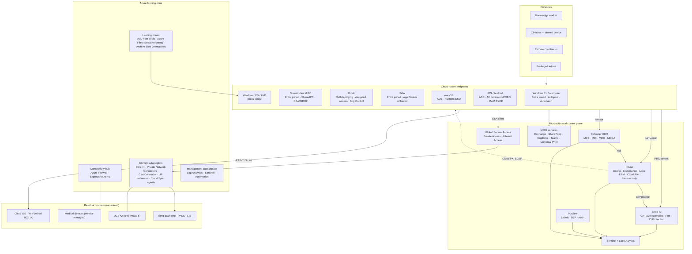

# Appendix I: Recommended Cloud-Native Architecture Design

> This is the reference design for the **end state**. It consolidates §3 (Future State) with the detailed component designs in Part B into one view that architects and engineers can implement.

## I.1 Reference architecture

## I.2 Design decisions summary (ADR index)

| ADR | Decision | Rationale | Section |
|---|---|---|---|
| ADR-01 | Entra join for all new and converted Windows devices | MS guidance; removes AD dependency; works anywhere | §5.4 |
| ADR-02 | Co-management as time-boxed bridge; MECM decommissioned M15 | Low-risk transition, clear exit | §5.7, §18 |
| ADR-03 | Managed authentication (PHS); AD FS retired | Security, simplicity, Cloud Sync path | §9 |
| ADR-04 | WHfB **cloud Kerberos trust** | No PKI dependency; on-prem SSO | §9 |
| ADR-05 | Cloud PKI (BYOCA) for authentication certs; PKCS only for S/MIME | Lowest ops; key stays on device | §16 |
| ADR-06 | Windows Autopatch for all servicing | Single servicing model; ring automation | §10.4 |
| ADR-07 | OneDrive KFM + SharePoint/Teams; Azure Files for app exceptions | Collaboration + governance; app compatibility | §12 |
| ADR-08 | Universal Print except EHR clinical printing | Server retirement; clinical safety | §12.7 |
| ADR-09 | Entra Private Access for private apps; VPN only for exceptions | ZTNA with per-app CA | §13.3.5 |
| ADR-10 | Sentinel as SIEM | Native integration; consolidated SOC | §13.6 |
| ADR-11 | AVD for clinical pooled VDI; W365 for contractors (gated) | Cost/fit per persona | §10.3.4 |
| ADR-12 | Intune for macOS with Platform SSO (unless D-08 says otherwise) | Single console | §10.3.5 |
| ADR-13 | Configuration as code (Git) for Intune/Entra | Change control, rollback, audit | §31.5 |
| ADR-14 | Residual AD in Azure IaaS (Tier 0); retirement gated | Honest scope for healthcare dependencies | §3.7, §15 |

## I.3 Non-functional requirements

| NFR | Requirement | Design response |
|---|---|---|
| Availability | Sign-in & device management available ≥ 99.9 % (Microsoft SLA) | Microsoft cloud SLAs; WHfB cached logon; backup authentication service |
| Resilience (on-prem dependencies) | No single point of failure in connectors | ≥ 2 Private Network Connectors / Cert Connectors / UP connectors / Cloud Sync agents in 2 locations |
| Recoverability | Endpoint RTO ≤ 1 h; config RTO ≤ 8 h | Autopilot re-provisioning; Git config restore |
| Security | Phishing-resistant MFA; compliant device for corporate data; least privilege | CA, compliance, PIM, EPM, LAPS |
| Compliance | HIPAA/HITRUST/PCI evidence on demand | Log Analytics/Sentinel retention; automated evidence exports |
| Performance | Provisioning ≤ 45 min; badge tap → EHR ≤ 30 s; boot-to-desktop −35 % | Thin ESP, DO/MCC, shared PC tuning, Endpoint Analytics |
| Scalability | 20,000+ endpoints; M&A onboarding in days | Cloud services; Cloud Sync for disconnected forests; Autopilot |
| Data residency | US | Tenant/regions US |

## I.4 Naming and tagging standards (excerpt)

| Object | Standard | Example |
|---|---|---|
| Windows device (assigned) | `CH-%SERIAL%` (≤ 15 chars) | `CH-5CG1234XYZ` |
| Windows device (shared/kiosk) | `CH-SH-%RAND:6%` / `CH-KS-%RAND:6%` | `CH-SH-4K9Q2M` |
| Intune policy | `<PLAT>-<TYPE>-<SCOPE>-<Desc>-v<n>` | `WIN-SC-ALL-Edge-Hardening-v2` |
| Entra group (device, dynamic) | `GRP-DEV-<Plat>-<Purpose>` | `GRP-DEV-WIN-Ring3` |
| Entra group (user) | `GRP-USR-<Purpose>` | `GRP-USR-EPM-Physicians` |
| CA policy | `CA<nnn>-<Persona>-<App>-<Control>` | `CA105-SharedClinical-All-CBA` |
| Autopilot group tag | Persona code | `KW`, `SHC`, `KSK`, `VIP`, `PAW` |
| Azure resources | CAF naming + tags (`CostCenter`, `Workload`, `Env`, `Program`) | `vm-dc-eus2-01` |
