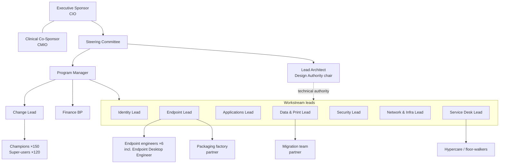

# Appendix J: Recommended Governance Structure

> A quick-reference companion to §31 Governance Model: the org chart, the meeting calendar, and the master RACI across workstreams.

## J.1 Program organization chart



## J.2 Meeting calendar

| Forum | Frequency | Duration | Chair | Key inputs | Key outputs |
|---|---|---|---|---|---|
| Steering Committee | Monthly (+ gates) | 60 min | CIO | Executive dashboard (App-E), decision papers | Decisions, gate outcomes |
| Clinical Advisory Group | Monthly + per clinical wave | 45 min | CMIO delegate | Clinical wave plans, pilot results | Clinical go/no-go |
| Security & Compliance Forum | Bi-weekly | 60 min | CISO | Exceptions, CA changes, evidence | Approvals |
| Design Authority | Bi-weekly | 90 min | Lead Architect | Design papers, ADRs, exceptions | ADRs, standards |
| PMO / workstream leads | Weekly | 60 min | PM | Status, RAID | Integrated plan updates |
| RAID review | Weekly | 30 min | PM | RAID log | Escalations |
| Cloud CAB | Weekly (+ emergency) | 45 min | Change Manager | Change requests | Approved changes |
| Wave go/no-go | Per wave (T-2 d) | 30 min | PM | App-C checklist | Go/no-go |
| Wave stand-up | Daily during waves | 15 min | Endpoint Lead | Wave tracker | Actions |
| Experience & Posture Review | Monthly (post-M12) | 60 min | Endpoint Lead | Endpoint Analytics, Secure Score | Optimization backlog |

## J.3 Master RACI (all workstreams)

| Workstream / activity | ES | PM | AR | ID | EP | SE | AO | SD |
|---|---|---|---|---|---|---|---|---|
| Strategy, funding, gates | **A** | R | R | C | C | C | C | I |
| Integrated plan & RAID | I | **A/R** | C | R | R | R | C | C |
| Architecture & standards | I | C | **A/R** | R | R | R | C | I |
| Identity modernization (§9) | I | C | C | **A/R** | C | R | C | C |
| Endpoint transformation (§10) | I | C | C | C | **A/R** | R | C | C |
| Application migration (§11) | I | C | C | C | R | C | **A**/R | C |
| User data & print (§12) | I | C | C | C | **A/R** | C | R | C |
| Security transformation (§13) | I | C | C | R | R | **A/R** | I | I |
| GPO migration (§14) | I | I | C | R | **A/R** | C | I | I |
| AD dependency assessment (§15) | I | C | **A** | R | R | R | R | I |
| Certificates (§16) | I | I | **A** | R | R | C | I | I |
| Autopilot (§17) | I | I | C | C | **A/R** | C | I | C |
| Co-management workloads (§18) | I | I | C | C | **A/R** | C | C | C |
| Pilots (§19) | I | **A** | C | R | R | R | R | R |
| Production rollout (§20) | I | **A** | C | C | R | C | C | R |
| Testing (§21) | I | C | **A** | R | R | R | R | R |
| Rollback & DR (§22) | I | C | **A** | R | R | R | I | C |
| Change, comms, training (§23–25) | C | **A** | I | C | C | I | R | R |
| Risk & compliance (§26–28) | C | R | C | C | C | **A** | C | I |
| Licensing & budget (§29–30) | **A** | R | C | C | C | C | I | I |
| Operations (§32) | I | I | C | R | R | R | I | **A**/R |
| Optimization (§33) | I | I | C | R | **A/R** | R | C | C |

## J.4 Escalation path

```
Engineer → Workstream Lead (same day) → PM / Lead Architect (24 h) → Steering Committee / Executive Sponsor (Critical: 24 h; High: next meeting)
Clinical safety concern → Clinical Advisory Group delegate (immediate) → CMIO (immediate) → pause authority
Security incident → SOC → CISO (per IR plan) → Executive Sponsor
```
