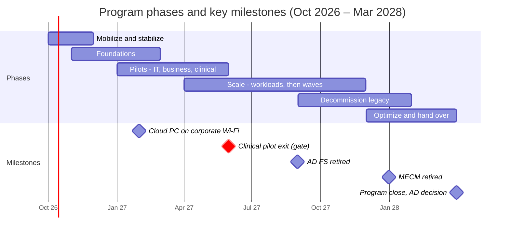

# Cloud Transformation — Leadership Summary

> As of 1 October 2026 · A short version of the full blueprint for leadership. Details are in the [Executive Summary (§1)](part-a-strategy/01-executive-summary.md), [Roadmap (§6)](part-a-strategy/06-phased-roadmap.md) and [License Requirements (§29)](part-d-risk-governance/29-license-requirements.md).

We can move all endpoints, collaboration, data and printing to Microsoft's cloud in 18 months (October 2026 – March 2028) if leadership approves the licensing uplift and resourcing by November 2026. Retiring Active Directory completely is a separate decision at month 18, not a promise today.

## Decisions needed

Seven decisions unlock the program. The first two set its pace.

| # | Decision | Why now | Needed by |
| --- | --- | --- | --- |
| D-01 | Licensing uplift: Microsoft 365 E5 for knowledge workers and all admins; a frontline security add-on for clinical staff | E5 includes the privileged-access, identity-threat and endpoint-detection controls a HIPAA covered entity needs | Nov 2026 |
| D-07 | Resourcing: 6 backfill staff for 18 months, a packaging and data-migration partner, Microsoft FastTrack | The current team already runs day-to-day IT at full capacity | Oct 2026 |
| D-02 | No new hybrid-joined devices after March 2027; every new PC ships cloud-native | Each hybrid device built now is debt we pay for later | Nov 2026 |
| D-04 | Convert existing PCs on the normal hardware refresh cycle (~3,000/year) plus a remote reset wave | Avoids a separate, costly re-imaging project | Nov 2026 |
| D-03 | Retire AD FS (on-prem sign-in federation) by July 2027 | A top attack target and a blocker to modern sync | Dec 2026 |
| D-05 | Archive or delete file-share data untouched for 3+ years (~70 TB) instead of migrating it | Cuts migration effort by ~40% and reduces patient-data exposure | Dec 2026 |
| D-06 | Agree clinical blackout calendars with nursing leadership and the CMIO | Clinical safety and adoption | Dec 2026 |

Each decision is tracked as a GitHub issue labelled `decision` (D-01 to D-14).

## Why change

Identity attacks are the main route into healthcare ransomware, and our current setup makes them easy. The move also fixes slow device delivery and avoids a datacenter refresh.

| Driver | Today | After the program |
| --- | --- | --- |
| Security | 38 domain admins; ~70% of service accounts never change password; sign-in runs through on-prem AD FS | Every sign-in checked against device health and risk; phishing-resistant sign-in; just-in-time admin rights |
| Compliance | HIPAA and HITRUST evidence assembled by hand | Policy-as-configuration with continuous, exportable evidence |
| Clinician experience | A replacement PC takes ~2.5 days and a technician on site; VPN for basic access | A ready device in under 4 hours, anywhere, with no technician; no VPN for Microsoft 365 or cloud apps |
| Cost | ~165 on-prem servers for end-user computing; hardware refresh due month 14 | 15 servers or fewer; refresh avoided |
| Platform deadlines | Windows 10 extended updates, ConfigMgr support, AD FS and Microsoft's sync changes all forcing action | One modern update and management model |

## Roadmap

**The clinical pilot in May 2027 is the gate to production waves.**

The phases overlap by design. Production waves begin only after the clinical pilot passes in May 2027, and the temporary MECM bridge is switched off in December 2027. Retiring the last domain controllers is a separate phase from April 2028, decided on evidence at program close.

## Licensing

We recommend Microsoft 365 E5 for the 7,300 knowledge workers, including all IT admins, and a frontline security add-on for the 1,900 clinical staff. If E5 isn't approved, the design still works on E3, with weaker controls.

| Group | People | Today | Recommended | If E5 isn't approved |
| --- | --- | --- | --- | --- |
| Knowledge workers | 7,300 | Microsoft 365 E3 | Microsoft 365 E5 | E3 + E5 Security add-on; buy the certificate service and admin-elevation tools separately, or go without them |
| IT and privileged admins (within the 7,300) | 220 | E3 | E5 (mandatory) | At minimum, Entra ID P2 for every admin |
| Clinical frontline on shared PCs | 1,900 | Microsoft 365 F3 | F3 + frontline Defender security add-on | F3 alone leaves shared PCs with no Defender endpoint protection once the old antivirus contract ends (June 2027) |
| Contractors with a corporate device | 600 | E3 | E3 (+ E5 Security if privileged) | No change |
| Contractors on their own devices | 500 | E3 | E3 or F3 + Windows 365 cloud PC | Azure Virtual Desktop |

Required regardless of the E5 decision:
- Windows 10 extended security updates (Year 2) for any of the ~1,600 Windows 10 devices not replaced or upgraded by mid-October 2026.
- Entra Private Access to replace VPN.
- Azure consumption for logging and residual servers.

List prices are left out on purpose. Confirm all quantities with the Microsoft account team.

## Outcomes

Leadership will see these eight measures each month on the executive dashboard. Baselines are estimates until discovery confirms them in December 2026.

| Measure | Baseline | Target (Mar 2028) |
| --- | --- | --- |
| Time from box to productive device (median) | ~2.5 days | Under 4 hours, no technician |
| Microsoft Secure Score | ~42% | 75% or more |
| Devices meeting security policy | not measured | 97% or more |
| Windows devices patched within 14 days | ~78% | 95% or more |
| Users on phishing-resistant sign-in | ~0% | 90% or more (100% of admins) |
| Endpoint Analytics experience score | not measured | 75 or more |
| On-prem servers supporting end-user computing | ~165 | 15 or fewer |
| IT tickets per 100 users per month | ~32 | 22 or fewer |

## Top risks

Four of these five risks are rated critical, and the first two are live today. All five are managed through gates that stop a wave before it affects clinical care.

| Risk | Severity | What we're doing |
| --- | --- | --- |
| Windows 10 extended security updates (Year 1) end 13 October 2026 | Critical | Buy Year 2 for the remaining devices in week 1; accelerate Windows 11 upgrades and replacements |
| Hidden dependencies on on-prem AD break clinical apps when PCs move to the cloud | Critical | Collect 60+ days of sign-in telemetry before any wave; a dependency check gates every wave |
| Badge-tap sign-in vendor not yet certified for cloud-joined shared clinical PCs | High | Vendor validation Nov 2026 – Jan 2027; shared clinical PCs stay on the hybrid bridge until certified |
| Patient data overshared during file migration | Critical | Sensitivity labels, data-loss prevention and permission review in place before the first share moves |
| Change fatigue in clinical staff | Critical | One change event per unit, blackout calendars, clinical super-users and on-floor support |

The full [Risk Register (§26)](part-d-risk-governance/26-risk-register.md) holds 40 program risks. The [Risk Analysis](risk-analysis/README.md) covers 100+ further risks and downtime scenarios.
