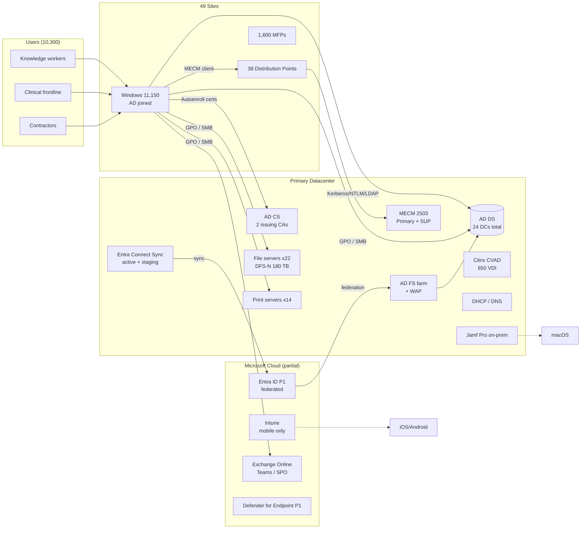

# 2. Current State Assessment

> **Part A: Strategy** · Section 2 of 33 · Baseline figures from [00 Assumptions](../00-assumptions-and-conventions.md) (`ASM-01` to `ASM-07`)

## 2.1 Assessment approach

The current state assessment runs from **M1 to M3**. It is partly **automated discovery**, which is objective and repeatable, and partly **structured interviews**, which find what the tools miss. Every finding lands in the RAID log, tagged by workstream.

| Domain | Discovery tool / method | Output | Owner |
|---|---|---|---|
| AD objects & hygiene | PowerShell AD export (users, computers, groups, OUs, SPNs, `pwdLastSet`, `lastLogonTimestamp`); **PingCastle** or **Purple Knight** health check; **Microsoft Defender for Identity** posture assessments **[E5 or MDI add-on]** | Object inventory, stale object list, Tier-0 exposure report | ID |
| Authentication flows | DC Security log analysis (4624/4625 logon types, **4776 NTLM**, 4768/4769 Kerberos); **NTLM auditing** GPO (`Network security: Restrict NTLM: Audit…`); LDAP **2889 events** (unsigned binds) with diagnostic logging level 2 on `16 LDAP Interface Events`; AD FS **relying party trust** usage report | Dependency map: what authenticates to which DC, with which protocol | ID + SE |
| GPOs | **Group Policy Analytics** in Intune admin center (import GPO XML backups); `Get-GPOReport -All`; GPO link and WMI filter inventory | GPO-to-Intune mapping with % MDM support (see §14) | EP |
| Devices | MECM hardware inventory (SQL views `v_GS_*`), MECM collections, Intune device inventory, Jamf inventory, **Endpoint Analytics** (once tenant attach is on), **Windows 11 readiness** report | Hardware age, TPM 2.0, OS build, Autopilot hash availability | EP |
| Applications | MECM application catalog export; **App-V/MSI/EXE** classification; **Software metering**; Intune **Discovered apps**; app owner interviews; App Assure readiness | App rationalization register (see §11) | EP + AO |
| File data | **SharePoint Migration Manager** scan / **SharePoint Migration Tool** pre-scan; TreeSize/WizTree; FSRM storage reports; NTFS ACL export (e.g., `Get-NTFSAccess`); DFS-N namespace export | Data volume, age, path length, invalid characters, ACL complexity | EP + Data team |
| Print | Print Management export (`Printbrm`); driver inventory; MFP scan-destination inventory | Queue rationalization, Universal Print readiness | EP |
| PKI | `certutil -view` per CA; template inventory; certificate-consumer interviews (Wi-Fi, VPN, S/MIME, web servers, code signing, medical devices) | Certificate consumer map (see §16) | ID + SE |
| Network | Proxy logs for M365 endpoint egress; WAN utilization; local-breakout capability per site | Internet-readiness per site | Network |
| Security | Microsoft **Secure Score**; Defender Vulnerability Management; CIS/STIG GPO comparison; current incident data | Security baseline and gaps | SE |
| Service management | ITSM ticket analysis, top 20 categories over 12 months | Pain points and post-migration targets | SD |

> **Tip for the endpoint engineer:** Turn on **tenant attach** and **Endpoint Analytics** for MECM-managed devices in **M1**. They need neither co-management nor licensing changes, and they give you startup performance, app reliability, and Windows 11 readiness data from day 1. That way you have a measured **baseline** for the KPIs later on.

## 2.2 Findings by domain

The following findings are **expected** from the baseline. Replace them with real data by M3.

### 2.2.1 Identity and Active Directory

| # | Finding | Impact on migration | Severity |
|---|---|---|---|
| CS-ID-01 | 38 Domain Admins; admin accounts used interactively on workstations | Credential theft path; Tier-0 compromise risk during migration changes | Critical |
| CS-ID-02 | ~1,350 service accounts, ~70 % with non-expiring passwords, many with SPNs (Kerberoastable) | Hidden dependencies; must be inventoried before any DC or AD FS change | Critical |
| CS-ID-03 | AD FS federation for primary domain; ~85 relying party trusts (RPTs), of which ~40 are SAML apps that can move to Entra Enterprise Apps | Blocks managed authentication; RPT migration effort | High |
| CS-ID-04 | UPN suffix `corp.contoso-health.org` (routable) matches email for 96 % of users; 4 % have mismatched UPN/mail | Sign-in failures and OneDrive provisioning issues for the 4 % | Medium |
| CS-ID-05 | ~1,900 stale computer objects (>90 days), ~1,100 stale users | Inflated sync scope; licensing waste | Medium |
| CS-ID-06 | OU structure organized by geography, not by management model | Hard to scope Entra Connect, GPO, and Hybrid join cleanly | Medium |
| CS-ID-07 | No Entra ID P2 → no PIM; global admins permanently assigned (11) | Standing privilege in cloud | High |
| CS-ID-08 | ~520 generic accounts used for shared/kiosk sign-in | Must classify: shared-device mode, kiosk, or eliminate | High |

### 2.2.2 Endpoints

| # | Finding | Impact | Severity |
|---|---|---|---|
| CS-EP-01 | ~1,600 Windows 10 devices; ~900 are hardware-incapable of Windows 11 (no TPM 2.0 / unsupported CPU) | Must replace; ESU Year 2 purchase needed | Critical |
| CS-EP-02 | No Autopilot hardware hashes registered; OEM registration not set up with resellers | Autopilot can't be used until hashes are captured or OEM-registered | High |
| CS-EP-03 | OSD task sequences have 1,100+ steps across 14 variants, many with driver packages from 2019 | Shows the level of image customization to remove | Medium |
| CS-EP-04 | Local admin rights held by ~2,300 users (physicians, research, IT) | EPM requirement; LAPS needed | High |
| CS-EP-05 | Legacy Microsoft LAPS on ~60 % of devices; Windows LAPS not used | Migrate to Windows LAPS backed up to Entra ID | Medium |
| CS-EP-06 | Shared clinical workstations depend on Imprivata OneSign + roaming profiles + GPO loopback | Critical clinical workflow; complex to move | Critical |
| CS-EP-07 | 300 Android devices on **device administrator** (deprecated by Google and Intune) | Must move to Android Enterprise dedicated (or fully managed) | High |
| CS-EP-08 | macOS managed by on-prem Jamf Pro; no Entra integration | Decide: Intune vs. Jamf Cloud + Entra device compliance integration | Medium |
| CS-EP-09 | Linux unmanaged | Compliance gap for HIPAA; Intune Linux enrollment (Ubuntu/RHEL) or MDE-only | Medium |
| CS-EP-10 | VDI is on-prem Citrix with AD-joined MCS images | Decide AVD/W365 vs. Citrix on Azure vs. retain | High |
| CS-EP-11 | BitLocker managed by MBAM-in-ConfigMgr; recovery keys in MECM database | Escrow keys to Entra ID before workload switch | High |

### 2.2.3 Applications

| # | Finding | Impact | Severity |
|---|---|---|---|
| CS-AP-01 | ~1,400 MECM apps and packages; estimate ~650 actively deployed after rationalization | Packaging effort for Win32 (`.intunewin`) | High |
| CS-AP-02 | EHR thick client (e.g., Epic Hyperspace) delivered via Citrix; local workstations run Citrix Workspace app plus peripherals (signature pads, scanners, label printers) | Peripherals and drivers are the risk, not the EHR itself | Critical |
| CS-AP-03 | ~120 apps use **integrated Windows authentication (Kerberos/NTLM)** against on-prem servers | Must work from Entra-joined devices through cloud Kerberos trust / PRT-to-TGT | Critical |
| CS-AP-04 | ~35 apps do **LDAP simple binds** to DCs (some hard-coded to DC IPs or names) | DC changes break these; LDAP signing enforcement breaks them | Critical |
| CS-AP-05 | ~60 browser apps require **IE mode** in Edge | Enterprise Mode Site List must be hosted in the cloud (M365 admin center) | Medium |
| CS-AP-06 | ~25 Access/Excel macro-based "shadow IT" tools mapped to `\\server\share` paths | Breaks when shares move to SharePoint | Medium |

### 2.2.4 Data, print, and infrastructure services

| # | Finding | Impact | Severity |
|---|---|---|---|
| CS-DT-01 | 180 TB on file servers; ~70 TB not accessed in 3+ years | Archive candidate (D-05) | High |
| CS-DT-02 | Deep folder nesting; ~8 % of paths > 400 characters; broken inheritance on ~30 % of department shares | SharePoint path limits (400 chars decoded URL) and permission complexity | High |
| CS-DT-03 | Folder Redirection to H: for 8,900 users, ~38 TB | Primary input to OneDrive Known Folder Move | High |
| CS-PR-01 | 3,200 print queues for 1,600 MFPs (duplicates per driver/site) | Rationalize to ~1,700 Universal Print shares | Medium |
| CS-PR-02 | Clinical label/wristband printers (Zebra) driven by EHR print services | **Out of scope for Universal Print**; keep EHR print path | High |
| CS-NW-01 | 42 clinics backhaul internet through the datacenter | M365/Intune/Autopatch traffic hairpins; Delivery Optimization and local breakout needed | High |
| CS-PK-01 | No NDES/SCEP; Wi-Fi 802.1X depends on AD-autoenrolled machine certs | Entra-joined devices won't get certs → can't join Wi-Fi without new design | Critical |

### 2.2.5 Security and operations

| # | Finding | Impact | Severity |
|---|---|---|---|
| CS-SE-01 | MDE P1 only; legacy EDR overlap | No automated investigation/response, threat & vulnerability mgmt limited | High |
| CS-SE-02 | No Conditional Access beyond "MFA for external" | Zero Trust controls absent | Critical |
| CS-SE-03 | MFA via SMS/voice for ~30 % of users | Phishable; not HIPAA best practice | High |
| CS-SE-04 | Security baselines applied via 40+ overlapping GPOs | Conflicts when moving to Intune security baselines | Medium |
| CS-OP-01 | No Intune RBAC model; 14 people hold Intune Administrator | Over-privileged | High |
| CS-OP-02 | Service desk has no Remote Help; uses on-prem remote control (MECM Remote Control) | Remote support breaks for Entra-joined / off-network devices | High |

## 2.3 Current state architecture

## 2.4 Current-state maturity scoring

Scored using the **0–5 readiness model** defined in Appendix B (0 = absent, 1 = initial, 2 = repeatable, 3 = defined, 4 = managed/measured, 5 = optimized).

| Domain | Score (baseline, est.) | Target M9 | Target M18 | Key gap |
|---|---|---|---|---|
| Identity & authentication | **2** | 3 | 4 | Federation, no PIM, weak MFA methods |
| Privileged access | **1** | 3 | 4 | Standing DA/GA, no tiering |
| Device management (Windows) | **3** (MECM) / **0** (Intune) | 3 | 4 | No Intune for Windows |
| Device management (mobile/mac/Linux) | **2** | 3 | 4 | Device admin Android, on-prem Jamf, Linux unmanaged |
| OS servicing & patching | **2** | 3 | 5 | WSUS/SUP manual; no rings |
| Application management | **2** | 3 | 4 | Sprawl, no rationalization |
| Data & collaboration | **2** | 3 | 4 | File shares dominant |
| Security operations | **2** | 3 | 4 | No Sentinel, no XDR |
| Zero Trust controls (CA, compliance) | **1** | 3 | 4 | No device-based CA |
| PKI & certificates | **2** | 3 | 4 | On-prem only, no SCEP |
| Monitoring & analytics | **1** | 3 | 4 | No Endpoint Analytics, no Log Analytics |
| Governance & operating model | **2** | 3 | 4 | No cloud CAB, no policy-as-code |
| **Overall (average)** | **≈1.8** | **3.0** | **4.1** | |

## 2.5 What this tells us

1. **The binding constraint is identity and dependency debt, not Intune.** Intune technology is mature. Contoso's AD (service accounts, LDAP binds, Kerberos-dependent apps, AD FS) is what sets the critical path.
2. **Clinical shared workstations are a separate program inside the program.** They need their own pilot, vendor certification, and rollback strategy.
3. **Certificates are an unseen blocker.** With no SCEP/PKCS today, an Entra-joined laptop can't get onto corporate Wi-Fi. This has to be solved in Phase 1, not discovered in the pilot.
4. **Discovery data from Defender for Identity and DC logs is worth more than any interview.** Start collecting it in week 2 so you have 60+ days of authentication telemetry before the pilots.
