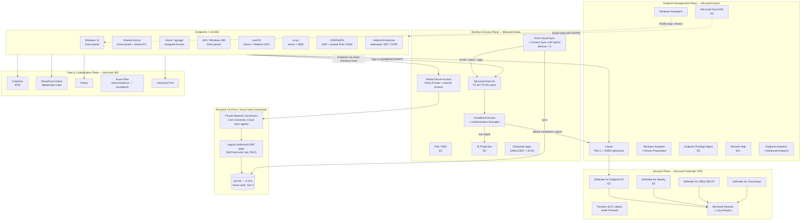
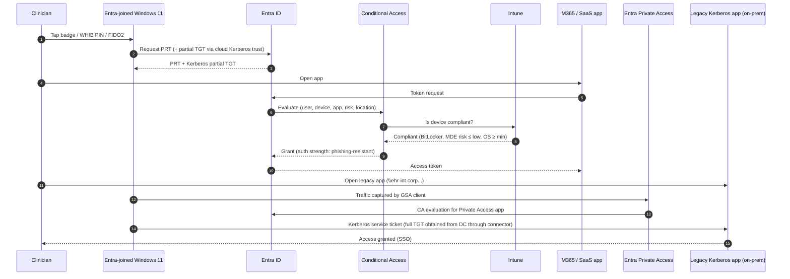

# 3. Future State Architecture

> **Part A: Strategy** · Section 3 of 33 · Detailed design per workstream is in Part B (§9–§18). The reference design is in Appendix I.

## 3.1 Architecture principles

| # | Principle | Implication | Basis |
|---|---|---|---|
| P1 | **Entra ID is the identity control plane** | Every user, device, app, and workload identity authenticates to Entra ID. AD DS becomes a downstream, legacy-compatibility directory. | [MS-BP] |
| P2 | **Cloud-native endpoints by default** | New Windows devices are Entra joined and Autopilot provisioned. Hybrid join exists only as a time-boxed exception with an exit date. | [MS-BP] |
| P3 | **Verify explicitly, least privilege, assume breach** | Conditional Access on every resource. Device compliance is a grant control. PIM for every privileged role. EPM instead of local admin. | Zero Trust [MS-BP] |
| P4 | **Configuration as code, single source of truth** | Intune configuration is exported and version-controlled (Microsoft Graph, Microsoft365DSC or IntuneManagement). Changes go through PR-reviewed change. | [OPINION] |
| P5 | **Phishing-resistant authentication** | WHfB, FIDO2/passkeys, and certificate-based authentication. SMS/voice are retired as MFA methods. | [MS-BP], HIPAA risk analysis |
| P6 | **No new on-prem dependencies** | Any new app or service must support SAML/OIDC + SCIM, or be published through Entra Private Access / App Proxy. | Governance |
| P7 | **Clinical safety over speed** | Clinical workflows get their own rings, pilots, rollback, and blackout windows. | Healthcare-specific |
| P8 | **Measure everything** | Every workstream reports KPIs into a Log Analytics workspace and Power BI. Go/no-go decisions are data-driven. | [OPINION] |

## 3.2 Logical architecture (end state, M18)

## 3.3 Component decisions (summary)

The full rationale and decision frameworks are in Part B.

| Capability | Today | Future state | Transitional (bridge) | Licensing note | Section |
|---|---|---|---|---|---|
| User sign-in authority | AD FS federation | **Managed auth: PHS + Seamless SSO (bridge) → PRT-based SSO** | Staged Rollout from AD FS | P1 | §9 |
| Sync | Entra Connect Sync | **Entra Cloud Sync** for users/groups. **Connect Sync retained only while Hybrid-joined devices exist** (Cloud Sync doesn't sync device objects). | Connect Sync ≥ 2.6.x | — | §9 |
| Strong auth | Password + SMS | **WHfB (cloud Kerberos trust)**, FIDO2, passkeys (Authenticator), **CBA** for shared clinical (badge/smart card) | Number-matching Authenticator | P1 (Auth Strengths) | §9, §13 |
| Device identity | AD joined | **Entra joined** | Hybrid Entra joined + co-managed | — | §10, §17 |
| Windows management | MECM | **Intune** | Co-management, workload by workload | E3 | §10, §18 |
| Provisioning | PXE / OSD | **Autopilot** (user-driven, pre-provisioned, self-deploying). **Autopilot device preparation** for simple user-driven profiles. | MECM OSD for in-life rebuilds until M12 | E3 | §17 |
| Patching | SUP / WSUS | **Windows Autopatch** (+ WUfB reports, driver & firmware mgmt) | Co-mgmt Windows Update workload | E3 (Autopatch included in E3/E5) | §10 |
| App delivery | MECM apps | **Intune Win32**, Enterprise App Catalog **[E5]**, Microsoft Store (winget), M365 Apps | MECM apps through co-mgmt "Client apps" workload | EAM is E5 | §11 |
| Privilege | Local admin + legacy LAPS | **Windows LAPS → Entra ID**, **EPM [E5]** | — | EPM: E5 | §13 |
| Certificates | AD CS autoenroll | **Cloud PKI [E5]** for device/user auth certs. **AD CS + Intune Certificate Connector (PKCS)** for S/MIME and other cases needing key archival. | NDES/SCEP fallback if not E5 | Cloud PKI: E5 | §16 |
| Wi-Fi auth | EAP-TLS via ISE with AD lookup | **EAP-TLS with Intune-issued cert**. ISE authorizes by cert attributes / Intune compliance API. | Dual SSIDs during transition | — | §16 |
| Remote access | Cisco VPN + DirectAccess | **Entra Private Access (ZTNA)**. VPN retained only for unsupported protocols. | VPN with Entra SAML + device cert | Entra Suite / Private Access SKU **[ADD-ON]** | §13 |
| User data | H: drives / Folder Redirection | **OneDrive + KFM** | Dual availability during cutover | — | §12 |
| Department data | DFS-N shares | **SharePoint/Teams**. Exceptions on **Azure Files**. Cold data to archive. | Read-only shares post-migration | — | §12 |
| Print | 14 print servers | **Universal Print** (native / connector). EHR clinical label printing stays on the EHR print path. | Universal Print connector on 2 VMs | UP included in E3/E5 (job quota) | §12 |
| Remote support | MECM Remote Control | **Intune Remote Help [E3+]** | — | E3+ | §32 |
| VDI | Citrix on-prem | **Azure Virtual Desktop** (multi-session, Entra joined) for clinical. **Windows 365** for contractors/third parties. | Citrix retained until EHR vendor certifies AVD | Azure consumption [ADD-ON] | §10 |
| macOS | Jamf on-prem | **Intune + Platform SSO (Entra)** **[OPINION]**, or Jamf Pro Cloud + Intune compliance partner if research requires Jamf | Jamf + Entra integration | — | §10 |
| SIEM | 3rd-party on-prem | **Microsoft Sentinel** (Defender XDR connector, Entra, Intune diagnostic logs) | Forward to existing SIEM during overlap | Sentinel consumption [ADD-ON]; E5 data grant | §13 |
| DNS / DHCP | Windows on DCs | **Azure DNS Private Resolver + on-prem DNS appliances** (Infoblox/BlueCat or Windows on non-DC servers). DHCP on network infrastructure. | AD DNS retained for residual AD | — | §15 |

## 3.4 Identity and access flow (end state)

## 3.5 Network architecture shift

| Aspect | Today | Future |
|---|---|---|
| Internet egress | Centralized backhaul from 42 clinics | **Local breakout for M365 "Optimize" and "Allow" endpoints** at all sites (SD-WAN). Entra Internet Access or existing SSE for web filtering. |
| Content delivery | 38 MECM DPs | **Delivery Optimization** (peer-to-peer, `DOGroupIdSource` = AD site → Entra tenant/subnet), **Microsoft Connected Cache** on 6–8 hub nodes (hospitals and the largest clinics) |
| Private app access | Full-tunnel VPN | **Entra Private Access** per-app segments, connectors in datacenter and Azure |
| Azure connectivity | 1 Gbps ExpressRoute (dev/test) | **Azure Landing Zone (hub-spoke or Virtual WAN)**, ExpressRoute 2× for resiliency, Azure Firewall |
| 802.1X | ISE + AD lookup | ISE + **certificate attributes** + Intune **compliance check through Graph** (ISE ↔ Intune integration uses the Compliance Retrieval API; validate the ISE version supports it) **[ASSUMPTION ASM-04]** |

## 3.6 Management plane & admin model

| Element | Design |
|---|---|
| Admin workstations | **Privileged Access Workstations (PAW)**: Entra joined, Intune managed, Defender-hardened, separate admin accounts (cloud-only `adm-` accounts, no mailbox) |
| Admin roles | Entra built-in roles + **Intune RBAC custom roles** scoped with **scope tags** (by region/site and by platform); **PIM [E5]** for all eligible activation with approval for Global Admin, Intune Admin, Conditional Access Admin |
| Emergency access | 2 **break-glass** cloud-only accounts, FIDO2-protected, excluded from CA, monitored in Sentinel |
| Change control | Intune and CA changes through Git-backed config (Microsoft365DSC export daily), **multi-admin approval** in Intune for scripts, apps, and wipe actions **[MS-BP]** |
| Tenant | Single production tenant. **Separate test tenant** (Microsoft 365 E5 developer/trial or purchased) for CA and Intune policy validation |

## 3.7 What stays on-premises (and why)

| Component | Why it stays | Exit condition |
|---|---|---|
| AD DS (4 DCs in Azure IaaS + 2 in primary DC until Phase 6) | Kerberos/LDAP for EHR back-end, lab systems, PACS, medical device service accounts | All residual apps either modernized, moved to Entra Domain Services, or accepted as permanent exception |
| Entra Connect Sync | Device writeback/sync for Hybrid-joined shared clinical workstations until they convert | Hybrid-joined device count = 0 → migrate to Cloud Sync |
| Intune Certificate Connector (PKCS) | S/MIME with key archival | Business decision on S/MIME vs. Purview Message Encryption |
| Private Network Connectors | Entra Private Access / App Proxy | Permanent (connectors are lightweight, stateless) |
| Clinical label printing via EHR print services | EHR vendor requirement | EHR vendor roadmap |
| Citrix (until certified) | EHR vendor certification of AVD/W365 | Vendor certification + clinical pilot |
