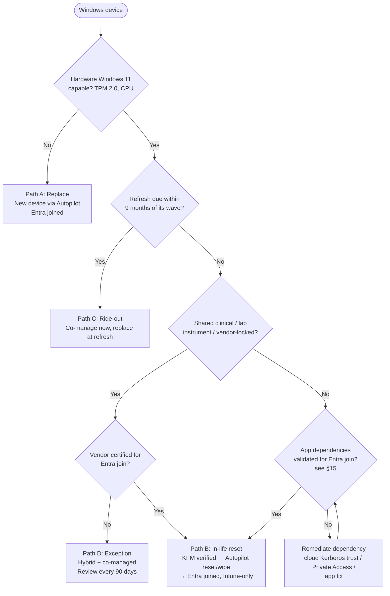

# 5. Migration Strategy

> **Part A: Strategy** · Section 5 of 33

## 5.1 Strategic stance

**"Bridge, then cross."** We use **co-management and Hybrid identity as a time-boxed bridge** so the existing fleet can be managed from the cloud quickly and at low risk. **Cloud-native (Entra join + Autopilot)** is the destination for every device. The bridge has an **expiry date for each component** (§5.6). Without expiry dates, transitional architectures quietly become permanent, and that is the most common failure mode in programs like this one.

## 5.2 Migration patterns by component (6R model)

| Component | Pattern | Target | Notes |
|---|---|---|---|
| AD DS | **Reduce → Relocate → (Retire, gated)** | 4 DCs in Azure IaaS (2 per region) + 2 on-prem until Phase 6 | Shrink scope first; never "lift" 24 DCs |
| AD FS | **Retire** | Entra managed auth | RPTs → Entra Enterprise Apps |
| Entra Connect Sync | **Replace** | Entra Cloud Sync | After hybrid devices = 0 (Connect Sync syncs devices; Cloud Sync doesn't) |
| DNS | **Re-platform** | Azure DNS Private Resolver + DNS appliances/servers not on DCs | Decouple DNS from DCs before DC reduction |
| DHCP | **Re-platform** | Network infrastructure (SD-WAN / switches / IPAM) | Remove from Windows servers |
| File servers | **Refactor / Retire** | OneDrive, SharePoint/Teams, Azure Files (exceptions), archive | §12 |
| Print servers | **Replace** | Universal Print | §12 |
| AD CS | **Replace (partially)** | Cloud PKI **[E5]**; AD CS retained for S/MIME and server certs until Phase 6 | §16 |
| VPN / DirectAccess | **Replace / Retire** | Entra Private Access; DirectAccess retired M6 | §13 |
| MECM | **Bridge → Retire** | Intune | Decommission criteria §5.7 |
| WSUS / SUP | **Retire** | Windows Autopatch / WUfB | §18 |
| Jamf on-prem | **Replace** (or re-host to Jamf Cloud) | Intune for macOS **[DECISION D-08]** | §10 |
| Citrix on-prem | **Re-platform (gated)** | AVD / W365 | EHR vendor certification |
| MBAM (in MECM) | **Replace** | Intune BitLocker + Entra key escrow | §13 |
| Legacy LAPS | **Replace** | Windows LAPS → Entra ID | §13 |
| Third-party SIEM | **Replace** | Microsoft Sentinel | §13 |

## 5.3 Windows device migration paths

Every Windows device in the estate goes down exactly one of four paths. The path is recorded per device in the migration tracker (Intune device category + an extension attribute).

| Path | Who | Join state journey | Management journey | Touch |
|---|---|---|---|---|
| **A. New/Refresh** | ~3,000/yr refresh + new hires + Win10 replacements (~900) | → **Entra joined** at OOBE | → **Intune only** | Zero-touch (OEM-registered Autopilot) |
| **B. In-life reset** | Win11-capable devices < 3 yrs old (~5,500) | AD joined → Hybrid (bridge) → **Autopilot reset to Entra joined** | MECM → co-managed → Intune only | Low-touch (user backs up via OneDrive KFM first; remote wipe & re-provision) |
| **C. Ride-out** | Devices due for refresh within 9 months of their wave (~2,200) | AD joined → Hybrid | MECM → co-managed (Intune for all workloads) | None until hardware refresh → Path A |
| **D. Exception (time-boxed)** | Shared clinical workstations pending vendor certification (~1,800), specific lab/instrument PCs (~150) | Hybrid joined (until certification) | Co-managed → Intune workloads | Converted in Phase 3b/4 or documented as permanent exception |

### 5.3.1 Device path decision tree

## 5.4 Hybrid Join vs. Entra Join: decision framework

**[MS-BP]** Microsoft's guidance: deploy new devices as Entra joined. Hybrid join through Autopilot isn't recommended. Use Hybrid join as a transitional state only.

| Criterion | Entra join | Hybrid Entra join | Weight |
|---|---|---|---|
| Access to on-prem Kerberos resources | ✅ through **cloud Kerberos trust** (WHfB) or password-based PRT → TGT; requires line of sight to a DC or Private Access | ✅ native | High |
| Machine-context (computer account) Kerberos auth to on-prem (e.g., computer-based ACLs, machine-authenticated SQL, GPO) | ❌ **no computer account in AD**. This is the key blocker to check. | ✅ | **Critical** |
| GPO dependency | ❌ (must be replaced by Intune) | ✅ (but conflicts with Intune) | High |
| Autopilot experience | ✅ best, works anywhere | ⚠️ needs DC line of sight + Intune Connector for AD; slower, more failure points | High |
| Works off-network on day 1 | ✅ | ❌ | High |
| Reduces AD dependency | ✅ | ❌ | High |
| Shared device / kiosk modes | ✅ (Shared PC, Assigned Access, multi-app kiosk) | ✅ | Medium |
| Third-party credential providers (badge tap) | ⚠️ vendor-specific. **Validate.** | ✅ | **Critical (clinical)** |

**Rule:** A device type defaults to **Entra join**. It may be Hybrid joined **only if** a documented, testable dependency appears in the **Critical** rows above and no remediation exists within the wave's timeline. Every Hybrid exception gets an owner and a review date.

## 5.5 Coexistence principles

1. **One authority per setting.** During co-management, every workload has exactly one authority (MECM or Intune). For every GPO area moved to Intune, the GPO is **unlinked from the wave's OU on the same day** (or filtered by security group). MDM wins over GPO only where `ControlPolicyConflict/MDMWinsOverGP` applies, and that covers Policy CSP areas only. Don't rely on it as a blanket safety net.
2. **Dual-run data access, single write location.** During file migration, source shares become **read-only** at cutover. They're never left writable in parallel.
3. **Identity changes are tenant-wide, so stage them.** Use **Staged Rollout** for AD FS → PHS, and **Authentication methods policy** groups for MFA method migration.
4. **No big bangs in clinical areas.** Clinical departments migrate one unit at a time, with at-the-elbow support present.
5. **Every change has a rollback** with a tested time-to-restore (see §22).

## 5.6 Bridge components and their expiry dates

| Bridge component | Introduced | Expires | Owner | Expiry criteria |
|---|---|---|---|---|
| Co-management | M3 | **M15** | EP | All workloads on Intune; 0 devices needing MECM |
| Cloud Management Gateway (CMG) | M2 | **M15** | EP | Co-management retired |
| Hybrid Entra join (general) | Existing | **M14** | EP + ID | Only Path D exceptions remain |
| Hybrid Entra join (Path D exceptions) | Existing | **M18 review** | EP + AO | Vendor certification / permanent exception sign-off |
| AD FS | Existing | **M10** | ID | All RPTs migrated; Staged Rollout 100 %; domain converted to managed |
| PHS + Seamless SSO (as the SSO mechanism for down-level devices) | M4 | Seamless SSO retired **M16** | ID | No down-level/Hybrid devices relying on it |
| Entra Connect Sync | Existing | **M18+** (Phase 6) | ID | Hybrid device count = 0 → Cloud Sync |
| VPN (Cisco) | Existing | **M14** (general users) | Network | Private Access covers all app segments |
| DirectAccess | Existing | **M6** | Network | All DA devices moved to VPN/Private Access |
| File servers (read-only) | M8 | **M16** | EP + Data | 90-day read-only period completed, backups retained per retention policy |
| Print servers | Existing | **M15** | EP | Universal Print 100 % excluding EHR clinical print |
| Citrix | Existing | **Gated** | EUC/VDI | EHR certification + AVD clinical pilot passed |

## 5.7 MECM: decommission vs. retain decision

**Position: decommission MECM by M15. [OPINION, strongly held]**

MECM is retained only through the transition, for these specific purposes:

| Retained purpose | Until | Replacement |
|---|---|---|
| OSD for in-life rebuilds of Hybrid devices | M12 | Autopilot reset / Autopilot (Path B) |
| Legacy app deployments not yet repackaged | M12 | Intune Win32 apps |
| Task sequence-based Win10 → Win11 in-place upgrades | M6 | Intune feature update policy (WUfB) |
| Patching for Path D exceptions | M12 | Autopatch (works for Hybrid co-managed devices with the Windows Update workload switched) |
| Server patching (if MECM also patches servers) | **Out of EUC scope**. Hand to **Azure Update Manager + Azure Arc**. | Azure Update Manager |
| Hardware/software inventory for asset management | M10 | Intune inventory + Properties catalog, MDE device inventory, ITSM integration through Graph |
| Reporting (SQL/SSRS) | M12 | Intune Data Warehouse, Graph, Log Analytics, Power BI |

**When retention would be justified (so it's not on reflex):** if Contoso had (a) large numbers of **air-gapped / no-internet** devices, (b) a **server estate** it chooses to keep patching with MECM, or (c) **complex OSD for specialist instrument PCs** with no OEM Autopilot path. Under the baseline assumptions only (c) applies, to ~150 lab instrument PCs. These are better handled as **Path D exceptions with manual/vendor imaging** than by keeping a whole MECM hierarchy alive. **[DECISION D-09]** confirms this at M9.

**Decommission gate (all must be true):**
1. 100 % of co-management workloads on Intune for all collections (§18).
2. No active MECM deployments with installs in the last 60 days.
3. BitLocker recovery keys for 100 % of devices escrowed in Entra ID (verified by report).
4. All reports moved to Intune/Log Analytics/Power BI and accepted by consumers.
5. MECM client removal through Intune script/remediation completed on ≥ 99 % of devices. The remaining devices are tracked.
6. Database backup archived per retention policy (recommend 12 months read-only).

## 5.8 Wave design principles

| Principle | Detail |
|---|---|
| Wave unit | **Department within site** (not entire site), max **1,000 devices/week** after the pilots |
| Ordering | IT → corporate/admin → remote/hybrid workers → ambulatory clinics → hospital non-clinical → hospital clinical → shared clinical/kiosks |
| Bundling | Combine changes per user touch: KFM + Entra join + WHfB + Universal Print in **one** user event where possible |
| Blackouts | Month-end close (Finance), open enrollment (HR), EHR upgrade weekends, flu/respiratory surge periods (clinical), Joint Commission survey windows |
| Capacity | Wave size limited by Service Desk capacity: ≤ 3 % incident rate per wave assumed for staffing |
| Gate | Previous wave's KPIs met for 5 business days (§20, §21) |
