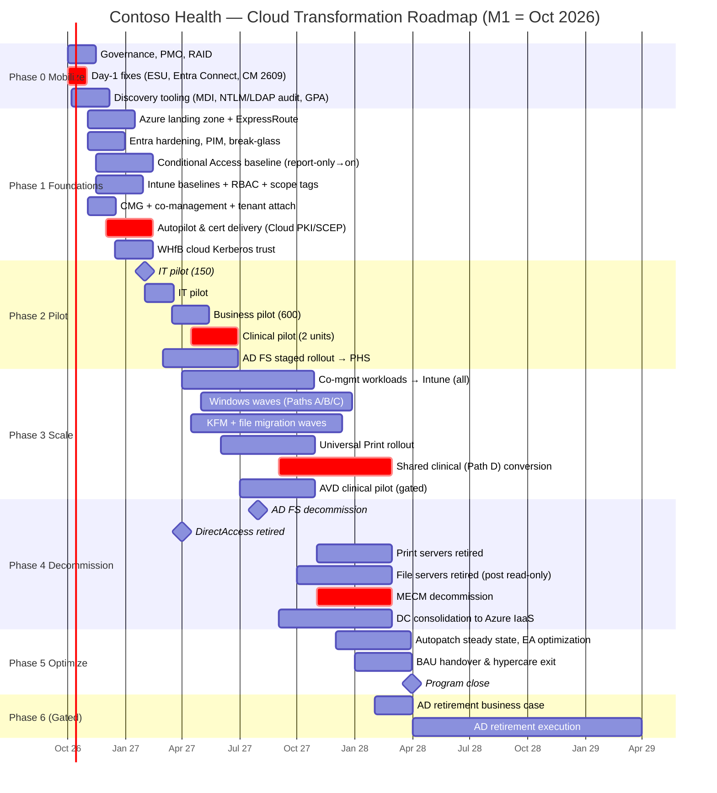
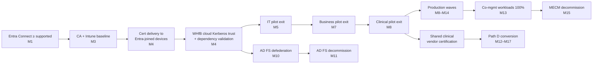

# 6. Phased Migration Roadmap

> **Part A: Strategy** · Section 6 of 33 · M1 = October 2026

## 6.1 Phase overview

| Phase | Name | Window | Entry criteria | Exit criteria (gate) |
|---|---|---|---|---|
| **0** | Mobilize & Stabilize | M1–M2 | Sponsor approval, budget released | Governance live; day-1 risks (R-001, Entra Connect version, ConfigMgr support) closed; discovery tooling collecting data |
| **1** | Foundations | M2–M5 | Phase 0 gate | Landing zone, CA baseline (report-only → on), Intune baselines, co-management enabled, Autopilot working end-to-end in lab, cert delivery to Entra-joined device proven, Group Policy Analytics done for the top 200 GPOs |
| **2** | Pilot | M4–M8 | Foundations gate (for the IT pilot); IT pilot exit (for business pilot) | IT pilot (150), business pilot (600), clinical pilot (2 units, ~120 devices + 80 shared) exit criteria met (§19) |
| **3** | Scale (Production waves) | M7–M14 | Business pilot exit | ≥ 95 % devices Intune-managed for all workloads; ≥ 85 % Entra joined; KFM 100 %; Universal Print live; file shares read-only |
| **4** | Decommission | M12–M16 | Wave completion per service | MECM, AD FS, DirectAccess, print servers, ≥ 18 file servers, ≥ 18 DCs retired |
| **5** | Optimize & Handover | M15–M18 | Decommission substantially complete | KPIs at target (§4.2); BAU operating model running for 60 days; lessons learned published |
| **6** | AD Retirement (gated) | M19–M30 | Business case approved at M18 Steering Committee | Residual AD dependencies resolved or accepted |

## 6.2 Roadmap (Gantt)

## 6.3 Workstream swim-lanes by phase

| Workstream | Ph 0 (M1–2) | Ph 1 (M2–5) | Ph 2 (M4–8) | Ph 3 (M7–14) | Ph 4 (M12–16) | Ph 5 (M15–18) |
|---|---|---|---|---|---|---|
| **Identity (§9)** | Connect version fix; sync scope review; stale object cleanup | Break-glass, PIM, auth methods policy, WHfB CKT, CA baseline | Staged Rollout PHS; RPT migrations; FIDO2 for admins | Defederate (M10); passkeys at scale; group SOA moves | AD FS decommission; DC reduction | Access reviews automation; Cloud Sync readiness |
| **Endpoint (§10, §17, §18)** | CM 2503 → 2609; tenant attach; EA baseline | CMG; co-mgmt; Intune baseline; Autopilot profiles; ESP; LAPS | IT/business/clinical pilots; workloads: compliance, EP, RA, WU | All workloads → Intune; waves A/B/C; Android DA → AE; macOS | MECM decommission | Autopatch tuning; EA remediation |
| **Apps (§11)** | Inventory, metering, owner mapping | Rationalize; packaging factory; EAM catalog | Pilot app sets (top 150 apps) | Remaining apps; IE mode list in cloud | Retire MECM apps | App lifecycle automation |
| **Data (§12)** | Scans; D-05 decision | Information architecture; labels; migration tooling | KFM pilot; first department shares | KFM all; Migration Manager waves; Universal Print | File/print server retirement | SAM, oversharing governance |
| **Security (§13)** | Secure Score baseline; MDI sensors on DCs | MDE P2 (E5) onboarding through Intune; ASR audit; Sentinel workspace | ASR block; CA device compliance enforced for pilot | CA compliance enforced org-wide; Private Access; EPM | Legacy EDR + SIEM retired | Purple-team validation |
| **Certificates (§16)** | Cert consumer inventory | Cloud PKI / NDES; ISE integration | Wi-Fi/VPN on Entra-joined pilot devices | Scale | AD CS footprint reduction | — |
| **Change & Comms (§23–25)** | Stakeholder map; champions recruited | Comms calendar; training content | Pilot comms; feedback loops | Wave comms; at-the-elbow | Decommission notices | Adoption measurement |

## 6.4 Critical path

**Critical path items:**
1. **Certificate delivery to Entra-joined devices** (Wi-Fi access). If this isn't ready, Entra-joined devices can't connect on-site.
2. **Dependency validation for Kerberos/NTLM/LDAP apps** (§15). If this is incomplete, you can't move clinical areas.
3. **Shared clinical workstation vendor certification** (R-003). This sets the end date for Hybrid join.

## 6.5 Phase gate governance

Each gate is reviewed at the Steering Committee (§31) using a **gate scorecard**:

| Gate criterion type | Example | Pass threshold |
|---|---|---|
| Technical | Autopilot success rate in pilot | ≥ 95 % first-time success |
| Operational | Service desk incident rate per migrated device | ≤ 3 % in first 10 days |
| Security | Devices compliant in migrated cohort | ≥ 95 % within 24 h |
| User | Pilot satisfaction survey (CSAT) | ≥ 4.0 / 5 |
| Clinical safety | Unplanned clinical downtime attributable to migration | **0 events** |
| Readiness | Readiness score for next phase (App-B) | ≥ 3.5 average, no domain < 3 |

Outcome options: **Go**, **Go with conditions** (named owner + date), **No-go** (remediation plan within 10 business days).
