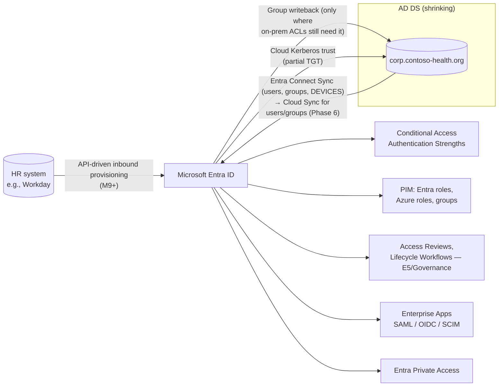

# 9. Identity Modernization Plan

> **Part B: Workstream Plans** · Section 9 of 33 · Lead: Identity Team · Related: §13 Security, §15 AD Dependencies, §16 Certificates

## 9.1 Objectives

| # | Objective | Measure | Target |
|---|---|---|---|
| ID-O1 | Entra ID is the primary authentication authority | Domain authentication type | **Managed** (no AD FS) by M10 |
| ID-O2 | Phishing-resistant authentication | % users with WHfB / FIDO2 / passkey / CBA registered **and used** | ≥ 90 % (100 % of admins) by M18 |
| ID-O3 | No standing privilege | Permanent privileged role assignments | 2 (break-glass only) |
| ID-O4 | Clean, minimal directory | Stale objects; service accounts with non-expiring passwords | 0 stale > 90 d; ≥ 80 % service accounts gMSA or retired |
| ID-O5 | Cloud source of authority for new objects | New groups created cloud-only; new users provisioned by HR-driven provisioning | 100 % of new groups cloud-only by M12 |
| ID-O6 | Sync platform modernized | Entra Connect Sync → Cloud Sync | Readiness by M18; cut-over in Phase 6 |

## 9.2 Target identity architecture

## 9.3 Workstream plan

### 9.3.1 Stage 1: Stabilize and clean (M1–M3)

| Step | Action | Tool / feature | Notes |
|---|---|---|---|
| 1 | Verify and upgrade **Entra Connect Sync** (≥ 2.5.79.0 now; target current 2.6.x); keep staging server in lockstep | Entra Connect, Connect Health | Minimum-version deadline was 30 Sep 2026 |
| 2 | Review sync scope: OU filtering, exclude service accounts that don't need cloud identity, include device OUs for Hybrid join | Entra Connect wizard → Domain/OU filtering | Document every change in the Design Authority |
| 3 | Fix UPN ≠ mail mismatches (CS-ID-04) | PowerShell, IdFix | Communicate UPN changes; OneDrive URL changes |
| 4 | Stale object cleanup: disable > 90 days, delete > 180 days (after app owner confirmation for service/generic accounts) | AD PowerShell + approval workflow | Use a quarantine OU before deletion |
| 5 | **Break-glass** accounts ×2 (cloud-only, `.onmicrosoft.com`, FIDO2 keys in separate safes, excluded from CA, sign-in alert in Sentinel/Log Analytics) | Entra | [MS-BP] |
| 6 | Reduce Global Admins from 11 to ≤ 4 eligible + 2 break-glass; move to least-privileged roles (Intune Administrator, Conditional Access Administrator, etc.) | Entra roles, PIM **[E5]** | Without P2: minimize, separate cloud-only admin accounts, and monitor |
| 7 | Separate admin accounts: cloud-only `adm-<user>@tenant.onmicrosoft.com` for Entra/Intune/M365 admin; on-prem `t0-`/`t1-` for AD tiers. **Never sync privileged AD accounts to Entra; never make synced accounts cloud admins.** | Entra, AD | [MS-BP] |
| 8 | Migrate legacy MFA and SSPR policies to the **Authentication methods policy**; enable Authenticator (number matching, app context), FIDO2, passkeys in Authenticator, Temporary Access Pass (TAP) | Entra → Authentication methods | Remove SMS/voice for admins immediately; for users by M9 |
| 9 | Deploy **Defender for Identity** sensors (DCs, AD FS, AD CS, Connect) | MDI **[E5]** | Feeds dependency analysis (§15) and Tier-0 protection |

### 9.3.2 Stage 2: Authentication modernization (M3–M11)

| Step | Action | Detail |
|---|---|---|
| 10 | **Seamless SSO** enable (bridge) | For Hybrid-joined down-level and non-PRT scenarios during staged rollout. Roll `AZUREADSSOACC` key every 30 days. |
| 11 | **Staged Rollout** from AD FS to PHS | Groups: IT (M5) → business pilot (M6) → 25 % → 50 % (M7) → 100 % (M8). Watch sign-in logs for `Authentication Details` and failure codes. |
| 12 | **AD FS relying party trust migration** | Use the **AD FS application activity report** / migration tool in Entra to classify ~85 RPTs: *Ready* (SAML/WS-Fed to Enterprise App), *Needs review* (claim rules), *Additional steps* (custom MFA, unsupported rules), *Retire*. Move ~40 SAML apps to Entra Enterprise Apps with SCIM where the vendor supports it. |
| 13 | **Defederate** (convert domain to managed) | After 30 days at 100 % staged rollout with < 0.1 % auth failure delta. Cut-over in a low-usage window (Sunday 02:00) with AD FS kept running in warm standby for 30 days (rollback). |
| 14 | Decommission AD FS + WAP | After 30 days of zero AD FS token issuance (AD FS admin log/Connect Health). Remove device writeback if only used for AD FS. Revoke AD FS token-signing certificates. |
| 15 | **WHfB cloud Kerberos trust** | Create `AzureADKerberos` server object per domain (`Set-AzureADKerberosServer`). Intune policy: *Windows Hello for Business* (Identity protection / account protection) + `UseCloudTrustForOnPremAuth` = enabled. **Avoid key trust / certificate trust**: no PKI dependency, no sync delay. |
| 16 | FIDO2 / passkeys | Admins first (FIDO2 keys, M3), then shared-device users needing roaming credentials, then passkeys in Microsoft Authenticator for mobile-first users. |
| 17 | **Certificate-based authentication (CBA)** for shared clinical badge/smart-card scenarios | Entra CBA with the issuing CA uploaded to Entra; username binding on `certificateUserIds`. Validate with tap-badge vendor (R-003). |
| 18 | Retire SMS/voice | Authentication methods policy: disable after ≥ 95 % of users hold a stronger method. Exceptions group with an expiry date. |

### 9.3.3 Stage 3: Cloud source of authority and governance (M8–M18)

| Step | Action | Detail |
|---|---|---|
| 19 | **New groups cloud-only** | All new security/M365 groups are created in Entra. Dynamic groups for device/user targeting. |
| 20 | **Group Source of Authority (SOA) conversion** | Move eligible synced groups (used only for cloud resources) to cloud-managed using Entra's group SOA capability; use **Cloud Sync group provisioning to AD** only where on-prem ACLs still require the group. |
| 21 | **HR-driven provisioning** | Entra **API-driven inbound provisioning** (or Workday/SuccessFactors connector) → create users in AD (while needed) or directly in Entra for cloud-only roles. Joiner/Mover/Leaver through **Lifecycle Workflows** **[E5 / Entra ID Governance]**. |
| 22 | Access reviews | Quarterly reviews for privileged groups, guest access, PHI-bearing SharePoint sites. **[E5/P2]** |
| 23 | Cloud Sync readiness | Run the **guided migration workflow** in Entra Connect 2.6.x to assess. **Blocker:** Cloud Sync doesn't sync devices, so Hybrid-joined devices must reach 0 first (or accept Connect Sync for devices until then). |
| 24 | Service account remediation | Convert to **gMSA** / **dMSA** (Windows Server 2025 delegated MSA) where on-prem; to **managed identities / workload identities** in Azure/Entra for cloud-hosted services. |

## 9.4 Decision framework: authentication method by persona

| Persona | Primary sign-in | Backup | MFA strength in CA | Notes |
|---|---|---|---|---|
| Knowledge worker (assigned device) | **WHfB** (PIN/biometric) | Authenticator passkey | Phishing-resistant | TAP for onboarding |
| Remote / mobile-first | Passkey in Authenticator | WHfB | Phishing-resistant | |
| Clinical shared workstation | **Badge tap → CBA** or vendor-integrated FIDO2 | Username + password + Authenticator (fallback) | Multifactor (CBA counts as phishing-resistant MFA when configured as multifactor) | Vendor dependency (R-003) |
| Kiosk / signage | No interactive user (Assigned Access, autologon) | — | Device-based | Exclude from user CA; restrict by device filter |
| Contractors / affiliates (non-corporate device) | Authenticator (number matching) or passkey | — | MFA + app protection / W365 | Access through W365/AVD or MAM |
| Privileged admins | **FIDO2 key** (hardware) | Second FIDO2 key | Phishing-resistant + compliant PAW | PIM activation needs auth context |
| Break-glass | FIDO2 key | — | Excluded | Monitored |

## 9.5 Decision framework: Entra Connect Sync vs. Cloud Sync

| Question | If yes → | If no → |
|---|---|---|
| Do you still have **Hybrid Entra joined** devices? | **Keep Connect Sync** (device sync) | Cloud Sync is viable |
| Do you need **Exchange hybrid writeback** for on-prem Exchange recipients? | Validate Cloud Sync Exchange hybrid writeback support at the time of migration | — |
| Any domain > 150,000 objects or groups > 50,000 members? | Connect Sync (Cloud Sync limits) | Cloud Sync |
| Custom sync rules with complex transformations? | Re-engineer as Cloud Sync attribute mapping expressions, or keep Connect Sync | Cloud Sync |
| Disconnected forests (M&A clinics)? | **Cloud Sync** (it supports disconnected forests) | Either |

**Contoso position:** keep Connect Sync through M18 because Path D Hybrid devices exist. Use **Cloud Sync in parallel for acquired-clinic forests** (M&A). Full cut-over in Phase 6. Microsoft is notifying tenants of their individual transition windows starting July 2026, so **watch Message Center**. If Contoso's window falls inside the program, re-plan step 23.

## 9.6 Conditional Access policy set (identity-owned subset)

The full policy set, with device controls, is in §13. These are the identity-owned policies:

| ID | Policy | Users | Apps | Conditions | Grant / session | Mode → Enforce |
|---|---|---|---|---|---|---|
| CA001 | Block legacy authentication | All | All | Client apps: Exchange ActiveSync, Other clients | Block | M3 |
| CA002 | Require MFA for all users | All (excl. break-glass, kiosk service accounts) | All | — | Auth strength: MFA | M3 |
| CA003 | Phishing-resistant MFA for admins | Directory roles (all privileged) | All | — | Auth strength: Phishing-resistant | M2 |
| CA004 | Secure security-info registration | All | User action: Register security info | Not from compliant device / trusted location | MFA or TAP | M3 |
| CA005 | Block high user risk | All | All | User risk: High | Block / require password change + MFA | M5 **[E5]** |
| CA006 | Sign-in risk MFA | All | All | Sign-in risk: Medium+ | MFA, sign-in frequency every time | M5 **[E5]** |
| CA007 | Block device code flow | All | All | Authentication flows: device code | Block (exceptions: Teams Rooms) | M4 |
| CA008 | Token protection for Windows sign-in sessions | Pilot → All | Exchange, SharePoint, Teams | Windows devices | Require token protection | M12 **[E5 or P1, validate licensing]** |

## 9.7 RACI: Identity Modernization

| Activity | ES | PM | AR | ID | EP | SE | AO | SD |
|---|---|---|---|---|---|---|---|---|
| Entra Connect upgrade & scope | I | I | C | **A/R** | C | C | I | I |
| Break-glass & admin model | I | I | C | **A/R** | I | R | I | I |
| Authentication methods policy | I | I | C | **A/R** | C | R | I | C |
| Staged Rollout & defederation | **A** | R | C | R | C | C | C | C |
| RPT → Enterprise App migration | I | C | C | **A/R** | I | C | R | I |
| WHfB cloud Kerberos trust | I | I | C | **A**/R | R | C | I | C |
| CBA for shared clinical | C | C | C | **A**/R | R | C | R | C |
| HR-driven provisioning / lifecycle | C | C | C | **A/R** | I | C | C (HR) | I |
| Service account remediation | I | C | C | **A**/R | I | C | R | I |
| Cloud Sync migration (Phase 6) | I | C | **A** | R | C | C | I | I |

## 9.8 Exit criteria

- [ ] Domain is **managed**. AD FS is decommissioned. No federated domains remain except where a documented exception exists.
- [ ] 0 permanent Global Admins outside break-glass. PIM is in use for all privileged roles **[E5]**.
- [ ] SMS/voice disabled except in a time-boxed exception group.
- [ ] ≥ 90 % of users have phishing-resistant methods registered. ≥ 80 % of sign-ins use them.
- [ ] Service-account inventory is 100 % owned. ≥ 80 % are remediated (gMSA/dMSA/managed identity/retired).
- [ ] Cloud Sync readiness assessment is complete, with documented blockers.
