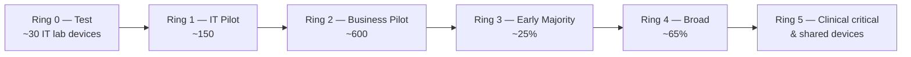

# 10. Endpoint Management Transformation Plan

> **Part B: Workstream Plans** · Section 10 of 33 · Lead: Endpoint Team · Related: §14 GPO migration, §17 Autopilot, §18 Co-management

## 10.1 Objectives

| # | Objective | Target |
|---|---|---|
| EP-O1 | Every endpoint in scope is enrolled in Intune (or Intune-registered with MAM for BYOD) | ≥ 99 % of in-scope inventory |
| EP-O2 | Windows: Entra joined, Intune-only | ≥ 85 % by M14; 100 % excl. signed exceptions by M18 |
| EP-O3 | One patching model | Windows Autopatch for 100 % of Windows; Apple DDM updates; Android OEMConfig/FOTA |
| EP-O4 | Compliance-driven access | CA "require compliant device" enforced for all platforms with corporate data |
| EP-O5 | MECM retired | M15 |

## 10.2 Intune tenant architecture

### 10.2.1 Administrative model

| Element | Design |
|---|---|
| **RBAC roles** | Custom roles: `EP-Intune-Engineer` (full config, no wipe), `EP-App-Packager` (apps only), `SD-Tier1` (read, sync, Remote Help view, BitLocker key with justification), `SD-Tier2` (+ Autopilot reset, LAPS read, Remote Help full control), `SEC-Analyst` (endpoint security read, MDE actions), `Site-Tech-<Region>` (scoped device actions) |
| **Scope tags** | By **region** (`EAST`, `CENTRAL`, `CORP`) and by **platform team** (`MAC`, `MOBILE`). Scope tags limit *visibility and edit rights*; they don't target policy. |
| **Multi-admin approval** | Required for: app deployments to "All devices", PowerShell scripts, remediations, device wipe/retire in bulk, RBAC changes [MS-BP] |
| **Targeting** | **Entra groups** for *who/what*, **assignment filters** for *conditions* (e.g., `device.deviceOwnership -eq "Corporate"`, `device.model -startsWith "OptiPlex"`, `device.enrollmentProfileName -eq "AP-Shared-Clinical"`). Avoid nested-group sprawl. |
| **Naming standard** | `<Platform>-<Type>-<Scope>-<Description>-<Version>`, e.g., `WIN-SC-ALL-SecurityBaseline-v1.2`, `WIN-CMP-ALL-Compliance-Standard-v1`, `IOS-APP-Clinical-SecureMessaging` |
| **Config as code** | Nightly export to Git (IntuneManagement / Microsoft365DSC / Graph API). PR review for production changes. Drift report weekly. |
| **Test tenant** | Mirror of production config. All CA and compliance changes tested there first. |

### 10.2.2 Group and ring model

The same rings are used for **policy change**, **app updates**, and **Autopatch** deployment groups. Device ring membership is held in an extension attribute (`extensionAttribute1` = `Ring2`). Dynamic groups are built from it: `(device.extensionAttribute1 -eq "Ring2")`.

## 10.3 Platform plans

### 10.3.1 Windows: assigned knowledge-worker devices (8,900)

| Area | Configuration |
|---|---|
| Join / enrollment | Entra join through Autopilot (Path A/B); existing devices co-managed through MECM until reset (Path B/C) |
| Baseline | **Windows security baseline** (Intune, latest version), **Microsoft Defender for Endpoint baseline**, **Microsoft Edge baseline**. Deviations recorded in a deviation register. |
| Endpoint security | Antivirus, firewall, **Attack Surface Reduction** rules (audit → block), **Exploit protection**, **Account protection** (Credential Guard, LSA protection), **Disk encryption** (BitLocker XTS-AES 256, TPM-only for silent enable, recovery key escrow to Entra ID before encryption), **Windows LAPS** (backup to Entra, 30-day rotation, post-auth reset), **EDR onboarding** |
| Privilege | Users are standard users. **EPM [E5]** for user-confirmed and support-approved elevation (physicians' dictation software, research tools). LAPS for support. |
| Settings | **Settings catalog** first; Administrative Templates (ADMX) only where settings catalog lacks a setting; custom OMA-URI as last resort |
| Apps | M365 Apps (Monthly Enterprise Channel), Edge, Company Portal, Teams, Citrix Workspace, required LOB, Win32 |
| Updates | **Windows Autopatch** (quality, feature, drivers & firmware, M365 Apps, Edge, Teams) |
| Compliance | `WIN-CMP-ALL-Standard` (see §10.5) |

### 10.3.2 Windows: shared clinical workstations (1,800)

| Area | Configuration |
|---|---|
| Identity | **Target:** Entra joined with tap-badge vendor's Entra-joined mode, CBA or FIDO2. **Bridge (Path D):** Hybrid joined, co-managed, all workloads on Intune. |
| Mode | **Shared multi-user device** settings (`SharedPC` CSP): account deletion on low disk / inactivity thresholds, guest disabled, fast first sign-in. **Don't use the Guest-account flavor of Shared PC** for clinical users, because they need identity-bound access to PHI. |
| Profiles | No roaming profiles. OneDrive KFM + **Files On-Demand**; EHR via Citrix/AVD (stateless). Optional FSLogix on AVD only. |
| Lockdown | Settings catalog: Start/taskbar layout, Edge kiosk-like restrictions through Edge policies, removable storage control (Defender Device Control). **Not** Assigned Access, because clinicians need multiple apps. |
| Session | Fast-user-switching off (vendor-dependent), screen lock 5–10 min per clinical policy, auto-logoff via vendor |
| Updates | Autopatch ring **Ring 5** with clinical maintenance windows (Update rings: active hours 06:00–23:00, deadline 7 days, grace 2 days, **restart only in agreed windows**) |
| Compliance | `WIN-CMP-Shared` (same security bar, but no user-based checks) |

### 10.3.3 Windows: kiosks, signage, patient check-in (450)

| Area | Configuration |
|---|---|
| Provisioning | **Autopilot self-deploying mode** (TPM 2.0 attestation, no user) |
| Mode | **Assigned Access** single-app (Edge kiosk for signage, check-in app) or multi-app kiosk (XML through the Intune *Kiosk* profile or the Assigned Access CSP) |
| PCI | Check-in/payment kiosks: separate group, PCI-hardened configuration, Defender Device Control (USB block), application control (**App Control for Business** in enforced mode with managed installer = IME) |
| Identity | Device-only; kiosk autologon local account. **No generic AD accounts.** Removes ~200 of the 520 generic accounts. |

### 10.3.4 Virtual desktops (650)

**Decision framework: AVD vs. Windows 365 vs. Citrix-on-Azure vs. retain on-prem Citrix**

| Criterion | AVD (multi-session) | Windows 365 (Cloud PC) | Citrix DaaS on Azure | Keep on-prem Citrix |
|---|---|---|---|---|
| EHR vendor certification | Check | Check | Usually yes | Yes |
| Cost model | Consumption; best for shift workers (pooled, autoscale) | Per-user fixed; best for 24×7 named users | Citrix licence + Azure | Capex refresh |
| Management | Intune (Entra-joined session hosts, multi-session supported) | Intune native | Citrix + Intune | Citrix + MECM/GPO |
| Peripheral redirection (signature pads, scanners, badge readers) | Good (RDP Shortpath, multimedia redirection), vendor-specific drivers | Same as AVD | **Strongest (HDX)** | Strongest |
| Ops effort | Medium (images, scaling) | Lowest | Medium | Highest |
| Fit | **Clinical pooled access (500)** | **Contractors/affiliates, offshore coders (150)** | If AVD peripheral testing fails | Not recommended past datacenter refresh |

**Recommendation:** AVD for clinical pooled access **gated by EHR certification and peripheral testing**, Windows 365 Enterprise for contractors and affiliates **[ADD-ON]**, and Citrix DaaS as plan B. **[DECISION D-10]** at M9.

### 10.3.5 macOS (650)

| Option | Pros | Cons |
|---|---|---|
| **Intune + Platform SSO** (recommended) | One console; Platform SSO (Secure Enclave key) gives Entra SSO and on-prem **Kerberos TGT mapping**; compliance native; DDM software updates | Jamf-specific research workflows need re-engineering; Self Service catalog → Company Portal |
| Jamf Pro Cloud + Intune compliance partner | Familiar to Mac admins; deep Apple features | Two consoles; licence cost; on-prem → Jamf Cloud migration anyway |

**Recommendation [OPINION]:** move to Intune unless research identifies ≥ 3 hard Jamf-only requirements. **[DECISION D-08]** at M5. Enrollment: **ADE** through Apple Business Manager, **Await final configuration**, Platform SSO with **Secure Enclave** key, FileVault with key escrow, DDM-based software update enforcement.

### 10.3.6 Linux (180)

- **Intune enrollment** for Ubuntu LTS / RHEL desktops (Intune app + Edge). Compliance: distro version, disk encryption (dm-crypt), password policy, custom compliance scripts.
- **Defender for Endpoint on Linux** for EDR.
- Configuration management stays with Ansible (research-owned), with compliance reported into Intune.
- Servers: out of scope (Azure Arc + Defender for Servers).

### 10.3.7 iOS / iPadOS (4,800 incl. BYOD)

| Persona | Enrollment | Notes |
|---|---|---|
| Corporate assigned | **ADE (user affinity)** with Company Portal or Setup Assistant with modern authentication | Supervised; managed apps; DDM updates |
| **Shared clinical iPhones (1,200)** | ADE **without user affinity** + **shared device mode** with Microsoft Authenticator (supported apps: Teams, Edge, Outlook, secure messaging vendor if MSAL shared-device-mode capable) | Sign-in/out per shift; validate secure messaging & barcode vendors |
| Shared iPad (education/rehab) | Shared iPad (Apple) with Managed Apple Accounts through **federation with Entra** | Optional |
| BYOD | **MAM without enrollment** (App Protection Policies, Level 2 "enhanced data protection"; Level 3 for PHI-heavy roles) + CA "require app protection policy" | No device management on personal phones |

### 10.3.8 Android (2,100 incl. BYOD)

| Persona | Mode |
|---|---|
| Zebra rugged dedicated (900) | **Android Enterprise dedicated devices** (COSU) with **Entra shared device mode** where apps support it; **Managed Home Screen**; Zebra OEMConfig; **FOTA [E3+ Plan 2]** for firmware |
| 300 device-administrator devices | Re-enroll as dedicated / fully managed (factory reset required). Schedule per department. **Device administrator management is deprecated.** |
| Corporate assigned | Fully managed (COBO) or COPE |
| BYOD | **Work profile** (personally owned) or MAM-only |

## 10.4 Windows servicing design

| Element | Design |
|---|---|
| Service | **Windows Autopatch**: tenant enrollment, **Autopatch groups** mapped to rings (Test, Ring1–Ring5), and the Last ring for clinical |
| Quality updates | Deferral: Test 0 d · R1 1 d · R2 3 d · R3 5 d · R4 7 d · R5 9 d. Deadline 2–5 d. **Expedite** capability for zero-days. Hotpatch for eligible Win11 Enterprise devices (VBS on, supported CPUs) to cut reboots on clinical devices |
| Feature updates | Pinned target version (Win11 24H2 → 25H2) with **feature update policy**; Autopatch release schedule; Win11 safeguard holds respected |
| Drivers & firmware | Autopatch / **Windows driver update management**: automatic approval for recommended drivers in R3+, manual approval for Ring 5 (clinical peripherals) |
| M365 Apps | Monthly Enterprise Channel, managed by Autopatch |
| Reporting | Windows Update for Business reports (Log Analytics) + Autopatch reports |
| Co-management prerequisite | **Windows Update, Device configuration, and Office Click-to-Run** workloads → Intune (or Pilot Intune) **and** MECM client setting *Software Updates = No* for those collections (Autopatch prerequisite) |

## 10.5 Compliance policy design

| Policy | Platform | Key settings | Actions for non-compliance |
|---|---|---|---|
| `WIN-CMP-ALL-Standard` | Windows | BitLocker required; Secure Boot; Code integrity; min OS build (N-1 feature, ≤ 60 days quality); firewall, AV, antispyware; Defender for Endpoint risk score ≤ **Medium** (Low for privileged users); TPM required; **Configuration Manager compliance** (co-managed only) | Mark non-compliant after 1 day (grace); email at 0 d; notification at 3 d; retire not automated |
| `WIN-CMP-Shared` | Windows shared | Same, minus user-based settings | Grace 1 day; Service Desk alert |
| `WIN-CMP-Kiosk` | Windows kiosk | Same + App Control enforced (custom compliance script) | Immediate alert |
| `MAC-CMP-Standard` | macOS | FileVault, SIP, firewall, min OS, MDE risk | Grace 3 days |
| `IOS-CMP-Corp` | iOS | Jailbreak blocked, min OS, passcode, MDE/MTD risk | Grace 1 day |
| `AND-CMP-Corp` | Android | Play Integrity (strong), min patch level ≤ 90 days, encryption | Grace 1 day |
| `LNX-CMP-Standard` | Linux | Distro allowed, encryption, password, MDE | Grace 3 days |
| **Tenant setting** | — | *Mark devices with no compliance policy assigned as* **Not compliant**; compliance status validity period 30 days | — |

Custom compliance (Windows) adds: Windows LAPS backed up recently, approved VPN/GSA client running, MECM client **absent** after M15 (to catch stragglers).

## 10.6 Endpoint management RACI

| Activity | ES | PM | AR | ID | EP | SE | AO | SD |
|---|---|---|---|---|---|---|---|---|
| Intune tenant architecture (RBAC, scope tags, naming) | I | I | C | C | **A/R** | C | I | C |
| Windows baseline & endpoint security policies | I | I | C | I | R | **A** | I | I |
| Compliance policy design | I | I | C | C | R | **A** | I | C |
| Shared clinical design | C | C | C | C | **A/R** | C | R (clinical informatics) | C |
| Kiosk/PCI design | I | I | C | I | R | **A** | C | I |
| VDI decision (D-10) | **A** | R | R | C | R | C | C | I |
| macOS decision (D-08) | I | C | **A** | I | R | C | C (research) | I |
| Mobile (iOS/Android) | I | I | C | C | **A/R** | C | C | C |
| Windows servicing / Autopatch | I | I | C | I | **A/R** | C | C | I |
| Config-as-code & change control | I | C | **A** | C | R | C | I | I |

## 10.7 Exit criteria

- [ ] ≥ 99 % of in-scope endpoints are Intune-enrolled or MAM-protected. The inventory reconciles across Intune, MDE, and ITSM.
- [ ] All Windows devices are on Autopatch. ≥ 95 % of quality updates land within 14 days.
- [ ] No Android device-administrator devices remain.
- [ ] D-08 (macOS) and D-10 (VDI) are decided and executed or planned.
- [ ] Compliance enforced through CA for all platforms. Non-compliance rate < 3 %.
