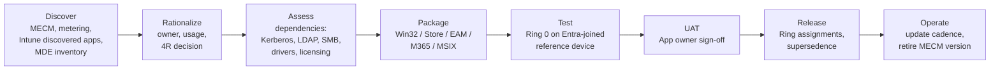
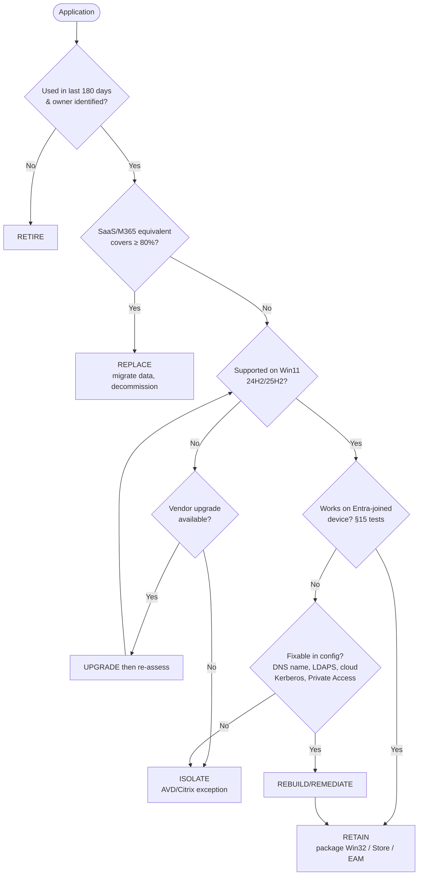

# 11. Application Migration Strategy

> **Part B: Workstream Plans** · Section 11 of 33 · Lead: Endpoint Team (packaging) + App Owners · Related: §15 AD dependencies, §21 Testing

## 11.1 Objectives

| # | Objective | Target |
|---|---|---|
| AP-O1 | Rationalize the portfolio before packaging | ~1,400 MECM objects → **≤ 650** supported apps |
| AP-O2 | Every supported app has a named owner, a delivery method, a test script, and a dependency profile | 100 % |
| AP-O3 | Apps validated on Entra-joined devices **before** each wave | 100 % of the wave's app set |
| AP-O4 | MECM application deployments retired | M12 |
| AP-O5 | Patch-current third-party apps | Top 50 third-party apps auto-updated (EAM catalog **[E5]** or Winget/partner) |

## 11.2 Process overview

## 11.3 Rationalization: Retain vs. Rebuild vs. Replace vs. Retire

### 11.3.1 Decision framework

| Decision | Criteria | Action |
|---|---|---|
| **Retire** | No installs in 180 days (metering), no owner within 30 days of inquiry, duplicate functionality, end-of-life vendor with no PHI obligation | Remove from MECM; uninstall through Intune remediation where present |
| **Replace (SaaS / M365)** | A SaaS or M365 capability covers ≥ 80 % of the need (e.g., PDF tools → Acrobat/Edge; FTP clients → SharePoint/OneDrive; ad-hoc Access DBs → Power Apps / Dataverse / SharePoint lists) | Business case with app owner; migration of data |
| **Retain (re-package)** | Business-required, works on Win11 + Entra join, vendor-supported | Repackage as Win32 (`.intunewin`) or use EAM catalog / Store |
| **Rebuild / Remediate** | Business-required but fails on Entra join (hard-coded DC, machine-account auth, LDAP simple bind, SMB to `\\server` by NetBIOS, legacy NTLM) | Remediate config (DNS, LDAPS, service account), vendor upgrade, publish through Private Access / App Proxy / AVD, or isolate to VDI |
| **Isolate** | Must keep legacy dependencies that can't be fixed in time (e.g., requires AD-joined machine) | Deliver through **AVD session host (Hybrid joined)** or Citrix; record a time-boxed exception |

### 11.3.2 Decision tree

## 11.4 Delivery method by app type

| App type | Preferred delivery | Notes |
|---|---|---|
| Microsoft 365 Apps | **Intune M365 Apps (Windows 10 and later)** app type or Win32 with ODT XML, Monthly Enterprise Channel | Use the Office Customization Tool XML. Shared clinical devices use **shared computer activation**. |
| Edge, Teams, OneDrive | Built-in / Autopatch-managed | Don't package |
| Common third-party (Chrome, Zoom, Adobe Reader, 7-Zip, Notepad++, Java runtimes…) | **Enterprise App Management catalog [E5]** (auto-update through supersedence) or **Microsoft Store app (new)** (winget source) | Removes the patching burden for the top ~50 third-party apps |
| MSI LOB | **Win32** (`.intunewin` wrapping, PSADT v4 for UX/deferrals) | Prefer Win32 over the "LOB" MSI app type to avoid mixing with Win32 in ESP |
| EXE installers | Win32 + PSADT | Detection: file/registry/MSI product code or script |
| App-V | **Re-package to MSIX or Win32** | App-V client is deprecated (supported with OS lifecycle only); don't carry forward |
| Clinical EHR client | Citrix Workspace app (Win32) + EHR-specific peripherals/drivers (Win32, dependencies) | Peripheral drivers are the test focus |
| Browser-based legacy | Edge **IE mode**, site list hosted in **M365 admin center → Org settings → Microsoft Edge site lists** (cloud site list) | Assign through Edge policy `InternetExplorerIntegrationCloudSiteList` |
| Browser extensions | Edge `ExtensionInstallForcelist` / `ExtensionSettings` (settings catalog), allow-list model | Block unknown extensions (`ExtensionInstallBlocklist = *`) for clinical rings |
| Drivers for peripherals (signature pads, label printers, scanners) | Win32 (pnputil) or **Windows driver update management** if WU-published | Test on reference hardware per model |
| Scripts/config "apps" | **Remediations (detect/remediate)** **[E3+]**, platform scripts | Not as fake Win32 apps |
| Access/Excel shadow tools | Replace with Power Platform or document as user-owned | Fix `\\server\share` paths (§12) |

## 11.5 Packaging factory

| Element | Standard |
|---|---|
| Throughput | Partner factory: 60–80 apps per month after ramp-up (M4). Internal: 15–20 per month for urgent or sensitive apps. |
| Toolkit | **PSAppDeployToolkit v4**, Microsoft Win32 Content Prep Tool, Master Packager/Advanced Installer (optional), MSIX Packaging Tool |
| Standards | Silent install/uninstall; return codes mapped (`3010` soft reboot); detection rule documented; requirement rules (OS, arch, disk); **install as SYSTEM** unless per-user; log to `%ProgramData%\Contoso\Logs\Apps` (collected by Intune diagnostics) |
| Naming | `<Vendor> <Product> <Version> [<Arch>]` + description with owner, ticket, and test evidence link |
| Supersedence | Every update supersedes the previous version (auto-update for "available" apps where appropriate) |
| Dependencies | Runtimes (VC++, .NET Desktop Runtime, Java) as separate Win32 apps with dependency relationships, max 2 levels deep |
| Assignment | **Required** for role-based core apps (to device groups for shared/kiosk, user groups for assigned devices); **Available** in Company Portal for optional apps; **Uninstall** assignments for retired apps |
| ESP | Block only on ≤ 6 truly essential apps (security agents, Citrix Workspace, Company Portal, M365 Apps, VPN/GSA client, EHR peripherals for shared devices). Everything else installs after the desktop. |
| Win32 + LOB mixing | **Never** mix MSI LOB apps and Win32 apps in the same Autopilot ESP (TrustedInstaller conflicts). Standardize on Win32. [MS-BP] |

## 11.6 Application dependency profile

Each app record in the register captures:

| Field | Values |
|---|---|
| Authentication | None / Entra (SAML/OIDC) / Windows Integrated (Kerberos) / Windows Integrated (NTLM) / LDAP bind / Local account |
| Directory dependency | Queries AD (LDAP/GC)? Hard-coded DC name or IP? Uses computer account? |
| Network | SMB paths (`\\server\share`) / ODBC / mapped drives / ports / IP allow-lists |
| Certificates | Client cert required? From which CA/template? |
| Printing | Prints to named queue? Uses EHR print service? |
| Peripherals | USB/serial devices, drivers |
| Licensing | Node-locked to hostname/MAC? Licence server? (**hostnames change with Autopilot naming**) |
| Data | Local data storage? PHI? Backup? |
| Run context | Runs as user / SYSTEM / scheduled task under service account |
| Entra-join test result | Pass / Pass-with-fix / Fail → path |

> **Common blocker:** node-locked licences tied to hostname. Autopilot device naming (`CH-%SERIAL%` / `CH-SH-%RAND:5%`) changes hostnames. Inventory these apps early and arrange vendor re-keying.

## 11.7 Testing approach for apps

| Level | What | Who | Exit |
|---|---|---|---|
| L1 Smoke | Install/uninstall/repair, detection, ESP behavior, launch | Packager | Automated where possible (Pester + Intune Graph status) |
| L2 Functional | Core use cases on an **Entra-joined, Intune-only, standard-user** reference device with production CA policies | App owner / power user | Signed test script |
| L3 Integration | Kerberos SSO, SMB, printing, peripherals, EHR context integration | App owner + EP | Pass in pilot ring |
| L4 Performance (clinical) | Launch time, EHR login time, badge tap → ready | Clinical informatics | ≤ baseline |

**Microsoft App Assure** (no-cost compatibility assistance for Windows 11 / M365 Apps / Edge) is engaged for any app that fails L1/L2 on Windows 11 and has no vendor fix.

## 11.8 Wave app readiness gate

A wave can't start until **≥ 98 %** of its *required* apps (weighted by user count) are **Retain/Remediate-complete with L2 pass**, and **100 % of clinical-critical apps** in the wave have L3/L4 pass.

## 11.9 RACI: Application migration

| Activity | ES | PM | AR | ID | EP | SE | AO | SD |
|---|---|---|---|---|---|---|---|---|
| Inventory & usage discovery | I | I | I | I | **A/R** | I | C | I |
| Rationalization decision (4R) | I | C | C | I | R | C | **A** | I |
| Dependency profiling | I | I | C | C | R | C | **A**/R | I |
| Packaging | I | I | I | I | **A/R** | C | C | I |
| L2/L3 testing & sign-off | I | I | I | I | R | I | **A**/R | C |
| Remediation of auth dependencies | I | C | C | **A**/R | C | C | R | I |
| IE mode site list | I | I | C | I | **A/R** | C | C | I |
| Browser extension governance | I | I | C | I | R | **A** | C | I |
| Knowledge articles per app | I | I | I | I | C | I | C | **A/R** |

## 11.10 Exit criteria

- [ ] App register complete, with owner, 4R decision, and dependency profile for 100 % of in-scope apps.
- [ ] 0 active MECM application deployments (M12).
- [ ] Top 50 third-party apps on auto-update (EAM/Store/winget).
- [ ] All isolated apps (AVD/Citrix) are documented, with an exception owner and a review date.
