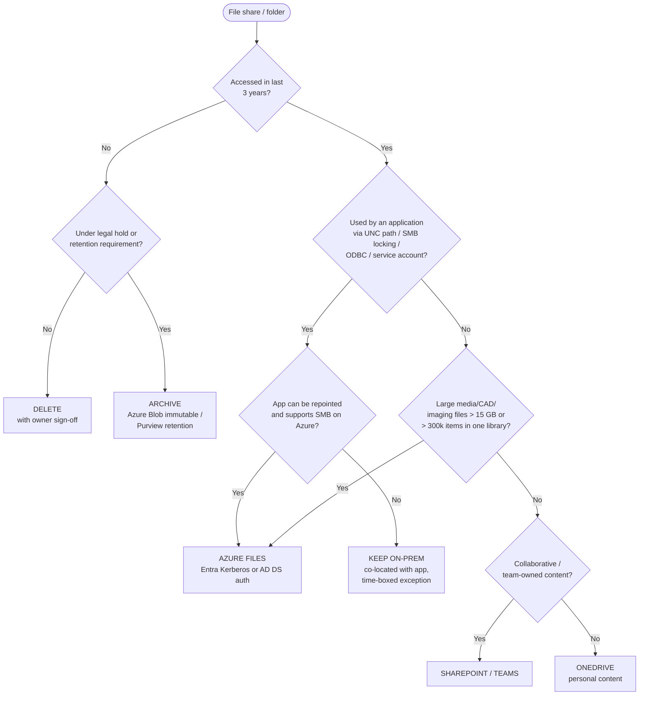

# 12. User Data Migration Strategy (incl. Print Modernization)

> **Part B: Workstream Plans** · Section 12 of 33 · Lead: Endpoint Team + Data/Collaboration Team · Related: §13 (Purview), §28 Compliance

## 12.1 Objectives

| # | Objective | Target |
|---|---|---|
| DT-O1 | Home drives and redirected folders → **OneDrive** with Known Folder Move | 100 % of users by M12 |
| DT-O2 | Department/project shares → **SharePoint / Teams** (or Azure Files where justified) | 100 % of in-scope active data by M14 |
| DT-O3 | Cold data **archived or deleted** rather than migrated (D-05) | ≥ 60 TB not migrated |
| DT-O4 | No permission regression and no oversharing of PHI | 0 PHI exposure incidents; sensitivity labels on 100 % of PHI sites |
| DT-O5 | File and print servers retired | M15 (print), M16 (file) |
| DT-O6 | Roaming profiles eliminated | 100 % (FSLogix only on AVD) |

## 12.2 Data landscape → target mapping

| Source | Volume (est.) | Target | Method |
|---|---|---|---|
| H: home drives (Folder Redirection: Documents, Desktop) | 38 TB | **OneDrive** (KFM: Desktop, Documents, Pictures) | KFM silent move + **Migration Manager** for H: content outside redirected folders |
| Department shares (active, < 3 yrs) | ~62 TB | **SharePoint sites** (one per department/function) / **Teams** (for active project collaboration) | Migration Manager (file share migration) |
| Project shares | ~10 TB | Teams-connected SharePoint | Migration Manager |
| Application data shares (apps writing to UNC paths) | ~8 TB | **Azure Files** (Entra Kerberos) or stays with the app server | Azure File Sync / Robocopy / AzCopy |
| Scanned documents (MFP scan-to-folder) | ~2 TB | OneDrive/SharePoint through **Universal Print scan jobs** or MFP vendor cloud connector | Re-point MFP scan destinations |
| Cold data (> 3 yrs untouched) | ~70 TB | **Archive** (Azure Blob, cool/archive tier, immutable) or **delete** per retention schedule | AzCopy + manifest; legal hold check |
| Roaming profiles | ~6 TB | **Not migrated**. Settings via Enterprise State Roaming / OneDrive / Edge sync; AVD → FSLogix on Azure Files. | — |

## 12.3 Decision framework: keep on-prem file server vs. SharePoint vs. Azure Files vs. archive

| Criterion | OneDrive | SharePoint / Teams | Azure Files | On-prem file server |
|---|---|---|---|---|
| Ownership | Individual | Team / department | App / workload | Legacy |
| Co-authoring, versioning, retention, DLP, labels | ✅ | ✅ | ❌ (Azure-level only) | ❌ |
| Works off-network without VPN | ✅ | ✅ | ⚠️ SMB 445 over internet often blocked; use Private Access | ❌ (VPN) |
| App compatibility (UNC, file locking) | ❌ | ❌ | ✅ | ✅ |
| Entra-joined access | ✅ | ✅ | ✅ (Entra Kerberos, **excluded from MFA CA**) | ✅ (cloud Kerberos trust) |
| Cost model | Included | Included (tenant storage pool) | Consumption | Capex |
| Contoso default | Personal data | **Default for shared data** | Exceptions | Time-boxed exceptions only |

> **Azure Files with Entra Kerberos gotchas:** (1) Entra Kerberos for Azure Files **doesn't support MFA**, so exclude the storage account's app from MFA CA policies and compensate with device compliance + network restriction (private endpoint through Private Access). (2) Setting NTFS ACLs for hybrid identities needs line of sight to a DC. (3) Group SID limit of 1,010 per ticket. (4) Cloud-only identity support is in **preview**. Use hybrid identities for production until it's GA.

## 12.4 OneDrive and Known Folder Move

| Step | Configuration |
|---|---|
| 1. Pre-provision | Pre-provision OneDrive for all licensed users (`Request-SPOPersonalSite`), storage quota 1 TB (5 TB available on request) |
| 2. Tenant settings | Restrict sync to domain-joined/Entra-joined (Tenant ID allow-list `AllowTenantList`); block personal OneDrive accounts (`DisablePersonalSync`); Files On-Demand on; **sync health reports** (`EnableSyncAdminReports`) |
| 3. KFM policy | Intune settings catalog → OneDrive: `KFMSilentOptIn` = tenant ID, `KFMSilentOptInWithNotification`, `KFMBlockOptOut` = 1, include Desktop/Documents/Pictures |
| 4. Folder Redirection exit | **Microsoft's documented sequence for folders redirected to a network share.** (a) **Migration Manager** copies each user's redirected content from `\\fs\home$\<user>\Documents` (and Desktop, Pictures) into the **existing Documents/Desktop/Pictures folders in that user's OneDrive**. Don't select *Preserve file share permissions*. Run delta passes. (b) **Disable the Folder Redirection GPO with "leave the folder and contents at the redirected location"**. (c) **Enable KFM**. Known folders move to OneDrive and **merge** with the pre-seeded content. Disable **Offline Files** first to avoid sync conflicts. The KFM GPO/Intune policy doesn't work while FR still redirects to a non-OneDrive location, so the order matters. |
| 5. Throttle | Microsoft recommends **≤ 1,000 existing devices/day and ≤ 4,000/week** for the silent KFM policy. 8,900 users ≈ **3 weeks minimum**. Plan KFM waves 1–2 weeks ahead of each device wave. Use the "limit upload rate" policy at bandwidth-constrained clinics. |
| 5a. H: remainder | Migration Manager (file share → OneDrive) for non-redirected H: content, delta passes, then H: drive mapping removed and the share set to read-only |
| 6. Verify | OneDrive sync health dashboard; KFM state per device (Intune custom compliance or remediation script reporting `KfmFoldersProtectedNow`) |

**Path B prerequisite:** an Autopilot reset/wipe of an in-life device is **only** allowed once KFM shows Desktop/Documents/Pictures protected and synced (sync status "Up to date"). This is enforced through a remediation script result that populates the wave tracker.

## 12.5 SharePoint / Teams migration

### 12.5.1 Information architecture

| Principle | Detail |
|---|---|
| Flat, hub-based | One site per department/function (Communication or Team site), associated to **hub sites** (Clinical, Corporate, Research, Revenue Cycle) |
| Don't replicate the folder tree | Max **3 folder levels** after migration; restructure the deep paths (CS-DT-02) |
| Library limits | Keep libraries < **300,000 items synced** for client performance; split large shares into multiple libraries |
| Permissions | Site-level permissions using **Entra security groups / M365 groups**; **no item-level unique permissions** unless justified |
| Sensitivity | Container labels (sites/teams) + default library labels for PHI sites. **[E5]** for auto-labeling / Purview DLP for Endpoint. |

### 12.5.2 Migration process (per share)

| Step | Action | Tool |
|---|---|---|
| 1 | Scan (path length, invalid chars, file types, size, ACL complexity) | Migration Manager scan / SPMT pre-scan |
| 2 | Owner workshop: what's in scope, target site/library, permission model | — |
| 3 | **Permission mapping**: AD groups → synced/cloud groups; break-inheritance hotspots flattened | ACL export + mapping CSV |
| 4 | Clean up (delete/archive ROT: redundant, obsolete, trivial) | Owner |
| 5 | Pre-migration (bulk copy, days before cutover) | Migration Manager |
| 6 | Delta passes (incremental) | Migration Manager |
| 7 | **Cutover**: source share ACL set to **read-only** (Deny Write for Everyone except migration account) → final delta → mapped drive removed through Intune/GPO → OneDrive shortcut / Teams link published | GPO/Intune, comms |
| 8 | Validation: file counts, sample checksums, permissions spot check, owner sign-off | Migration report |
| 9 | Hypercare 10 business days; read-only retention 90 days, then archive snapshot and decommission | — |

### 12.5.3 Hard-coded path remediation

Apps, macros, shortcuts, and scheduled tasks that reference `\\fs01\dept$\…` will break. Steps:

1. Search all Office files in the share for UNC links (`Get-ChildItem` + Office link scan, or a Migration Manager scan report).
2. Search MECM/Intune scripts, scheduled tasks, and app configs for UNC paths.
3. Register owners for each hit. Fix before cutover, or keep the item on Azure Files.

## 12.6 Archive and deletion (D-05)

| Element | Design |
|---|---|
| Policy | Records retention schedule approved by Compliance/Legal (HIPAA requires certain documentation be kept **6 years**. State medical records laws vary and are often longer. Clinical records live in the EHR, not on file shares.) |
| Process | Data owner notification → 30-day objection window → archive to Azure Blob (immutable, time-based retention policy) **or** delete with documented approval |
| Discoverability | Manifest (path, owner, hash, dates) stored in SharePoint list; eDiscovery request process documented |
| PHI | Archive storage is encrypted (CMK optional), private endpoints only, access through PIM-eligible role |

## 12.7 Print modernization

| Element | Design |
|---|---|
| Target | **Universal Print** for office and general printing; **EHR print services** retained for clinical labels/wristbands/prescriptions (CS-PR-02) |
| Printers | Universal Print-ready MFPs registered natively; older printers through **Universal Print connector** (2 VMs, HA by duplicate registration) |
| Rationalization | 3,200 queues → ~1,700 shares (one share per device; per-site naming `CH-<Site>-<Floor>-<Model>`) |
| Deployment | **Intune Universal Print printer provisioning** (settings catalog: Printer Provisioning) per site/floor group; users can add more from search by location |
| Pull printing / badge release | Check the third-party (e.g., PaperCut) Universal Print integration, or **Universal Print secure release with QR code** for non-PHI general printing |
| Scan | Universal Print **scan jobs** to OneDrive/SharePoint, or the MFP vendor's cloud connector; scan-to-SMB retired |
| Licensing | Universal Print included in M365 E3/E5/F3 with pooled job allowance; **validate the monthly job volume** (1,600 MFPs) and buy add-on volume if needed **[ADD-ON]** |
| Rollback | Print server queues kept for 30 days after each site cutover |

## 12.8 RACI: User data and print

| Activity | ES | PM | AR | ID | EP | SE | AO | SD |
|---|---|---|---|---|---|---|---|---|
| D-05 archive/delete decision | **A** | R | C | I | C | C | C (data owners + Legal) | I |
| Information architecture | I | C | **A** | C | C | C | R | I |
| KFM & Folder Redirection exit | I | I | C | I | **A/R** | I | I | C |
| SharePoint/Teams migration | I | C | C | C | **A**/R (Data team) | C | R | C |
| Permission mapping | I | I | C | R | R | C | **A** | I |
| Sensitivity labels / DLP | I | I | C | I | C | **A/R** | C | I |
| Azure Files exceptions | I | I | **A** | C | R | C | C | I |
| Universal Print rollout | I | I | C | I | **A/R** | I | C | C |
| File/print server decommission | I | C | **A** | I | R | C | I | I |

## 12.9 Exit criteria

- [ ] KFM is protected on 100 % of active user devices, and no H: drives are mapped.
- [ ] 100 % of in-scope shares are migrated or have an approved exception. Read-only period completed.
- [ ] Archive manifest complete. Deletions approved and logged.
- [ ] Universal Print is serving all non-clinical printing, and the print servers are retired.
- [ ] Sensitivity labels are applied to all PHI-bearing sites. Oversharing report reviewed (SharePoint Advanced Management, licensing permitting).
