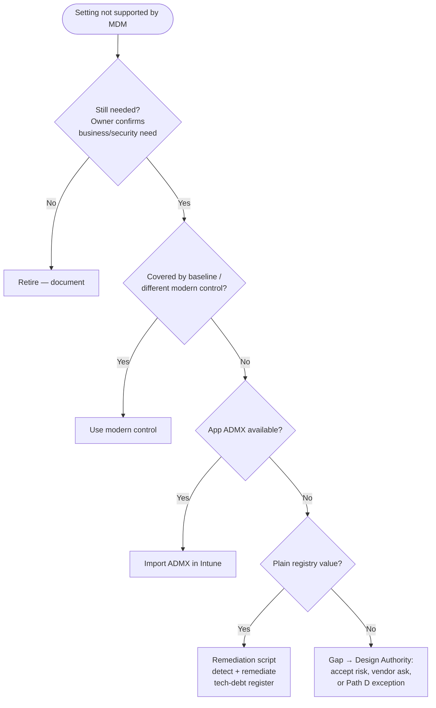

# 14. GPO-to-Intune Policy Migration Approach

> **Part B: Workstream Plans** · Section 14 of 33 · Lead: Endpoint Team · Related: §10, §13, §18 (Device configuration workload)

## 14.1 Principles

1. **Don't migrate GPOs. Migrate intent.** ~1,150 GPOs accumulated over 15+ years contain contradictions, dead settings (XP-era), and workarounds for problems that no longer exist. The goal is a **minimal, baseline-first** Intune configuration. It is not a 1:1 copy.
2. **Start from Microsoft security baselines.** Add only the deviations the business actually needs, each with an owner.
3. **Settings catalog first**, then Administrative Templates, then custom OMA-URI, then remediation scripts. A remediation script is a smell. Log each one in the technical debt register.
4. **One authority per setting.** When a setting area moves to Intune for a ring, the GPO is unlinked from or security-filtered out of that ring on the same day.
5. **Entra-joined devices don't process GPO at all.** Anything not rebuilt in Intune simply stops applying after the Path B reset. That makes the analysis non-optional.

## 14.2 Process

```mermaid
flowchart LR
    A[1. Inventory<br/>Get-GPOReport, links,<br/>WMI filters, empty/unlinked] --> B[2. Clean<br/>delete unlinked/empty,<br/>disable dead settings]
    B --> C[3. Analyze<br/>Group Policy Analytics<br/>MDM support %]
    C --> D[4. Classify<br/>Baseline / Keep / Replace /<br/>Retire / Not applicable]
    D --> E[5. Build<br/>settings catalog via GPA<br/>Migrate + baselines]
    E --> F[6. Test<br/>Ring 0 Entra-joined +<br/>co-managed device]
    F --> G[7. Cutover per ring<br/>assign Intune → unlink GPO<br/>for the ring's OU/group]
    G --> H[8. Verify & retire<br/>RSoP vs MDM report,<br/>delete GPO after last ring]
```

## 14.3 Step detail

### Step 1–2: Inventory and clean (M1–M2)

| Task | Command / method | Expected result |
|---|---|---|
| Export all GPOs | `Backup-GPO -All -Path D:\GPOBackup` and `Get-GPOReport -All -ReportType Xml` | Backup set for GPA import and rollback |
| Find unlinked GPOs | `Get-GPO -All` × `Get-GPInheritance` / XML `<LinksTo>` absence | ~35 % unlinked/empty (CS baseline) → archive and delete after 30 days |
| Find disabled-setting GPOs | `GpoStatus -eq AllSettingsDisabled` | Delete |
| WMI filter inventory | `Get-ADObject -Filter 'objectClass -eq "msWMI-Som"'` | Map to Intune **assignment filters** |
| Loopback inventory | Search reports for `UserPolicyMode` | Flag for shared-device redesign (§14.6) |
| Settings precedence conflicts | GPResult on representative devices per persona (`gpresult /h`) | Effective settings per persona, which is the real baseline to recreate |

### Step 3: Group Policy Analytics (M2–M3)

| Action | Detail |
|---|---|
| Import | Intune admin center → **Devices → Manage devices → Group Policy analytics → Import** the GPO XML backups (per-GPO `gpreport.xml`). Import in batches by OU. |
| Review | Per GPO: **MDM Support %**, and per setting: *Supported / Not supported / Deprecated*, with the **CSP mapping** |
| Migrate | Select supported settings → **Migrate** → creates a **settings catalog** profile (review and rename to the naming standard before assignment) |
| Report | Export the GPA report to CSV → Power BI: MDM support % by GPO, by category, by persona |

> **Interpretation tip:** GPA's MDM support % is per *setting present in the GPO*, not per *intent*. A GPO that is 40 % supported may be 100 % solvable, because the unsupported 60 % are drive maps and printer preferences you're replacing with OneDrive and Universal Print anyway. Classify before you panic.

### Step 4: Classification

| Class | Meaning | Typical % (est.) | Action |
|---|---|---|---|
| **Baseline** | Covered by Microsoft security baseline / Defender / Edge / M365 Apps baseline | 35 % | Use baseline profile; record deviations only |
| **Keep (migrate)** | Business-required setting, MDM-supported | 25 % | GPA Migrate → settings catalog |
| **Replace (modern equivalent)** | Achieved differently in the cloud model | 20 % | See §14.5 mapping |
| **Retire** | Obsolete (XP/IE/legacy), duplicate, contradicts baseline, no owner | 18 % | Don't migrate; document |
| **Not applicable / gap** | Required, no MDM equivalent, no modern replacement | ~2 % | ADMX ingestion, remediation script, or accept the gap. Each item goes to the Design Authority. |

### Step 5: Build

| Policy family (Intune) | Contents |
|---|---|
| `WIN-BL-*` Security baselines | Windows, MDE, Edge, M365 Apps (Microsoft baselines; deviations documented) |
| `WIN-ES-*` Endpoint security | AV, firewall (incl. rules migrated from GPO firewall rules), ASR, account protection, disk encryption, LAPS, EDR |
| `WIN-SC-*` Settings catalog | Everything else: power, Start/taskbar, Edge (non-baseline), OneDrive, Windows Update (Autopatch-managed), time zone, language |
| `WIN-AT-*` Imported ADMX | Third-party apps only (e.g., Citrix Workspace, Adobe, Chrome if retained, EHR vendor ADMX) through **Import ADMX** |
| `WIN-RM-*` Remediations | Registry/HKCU items with no CSP, legacy app tweaks, cleanup tasks |
| `WIN-PS-*` Platform scripts | One-off configuration (run once) |

### Step 6–8: Test, cutover, retire

| Step | Activity |
|---|---|
| Test | Ring 0: one Entra-joined device + one co-managed device per persona. Compare `MDMDiagReport` (Settings → Accounts → Access work or school → Export) vs. baseline GPResult. |
| Cutover (co-managed rings) | Assign Intune profile → confirm "Succeeded" for ≥ 95 % of the ring → **remove the ring's computers/users from GPO scope** (security filtering deny group `GPO-Exclude-Ring<n>` or OU relink) → `gpupdate /force` → verify |
| Conflict guard | Set **`ControlPolicyConflict/MDMWinsOverGP`** = 1 through settings catalog. It only covers **Policy CSP** settings, not Security baselines from GPO, Preferences, or scripts, so it's a safety net, not a strategy. |
| Tattooing | Some GPO registry settings persist after unlinking (tattooed). Intune overwrites them where it configures the same setting. For settings intentionally *dropped*, use a cleanup remediation script for key items. The Path B reset is the definitive clean slate. |
| Retire | After the final ring: GPO backed up → unlinked 30 days → deleted. The GPO count KPI goes on the technical dashboard. |

## 14.4 GPO areas → cloud equivalents

| GPO area | Intune / cloud equivalent | Notes |
|---|---|---|
| Password & account lockout (domain policy) | Entra password protection + Windows Hello; local account policy through settings catalog (`DeviceLock`, `LocalPoliciesSecurityOptions`) | Domain policy stays in residual AD |
| Security options, user rights assignment | Settings catalog (`UserRights`, `LocalPoliciesSecurityOptions`), security baseline | |
| Audit policy (advanced) | Settings catalog `Audit` CSP | Align with MDE/Sentinel needs |
| Windows Firewall | Endpoint security → Firewall + **Firewall rules** profiles | Migrate rules through GPA or export/import |
| Restricted Groups / local admin | Account protection → **Local user group membership** | |
| Software installation (GPO MSI) | Win32 apps | §11 |
| Logon/startup scripts | **Platform scripts** (run once) / **Remediations** (recurring) | Re-write; don't port verbatim |
| Drive mappings (GPP) | **OneDrive / SharePoint shortcuts / Teams**; interim: remediation script mapping Azure Files/on-prem with Kerberos | Remove at share cutover |
| Printer mappings (GPP) | **Universal Print** printer provisioning | §12.7 |
| Folder Redirection | **OneDrive KFM** | §12.4 |
| Registry preferences (HKLM) | Settings catalog / ADMX ingestion / remediation | |
| Registry preferences (HKCU) | Settings catalog user scope / remediation in user context | |
| Shortcuts, files (GPP) | Win32 "config package" or remediation; prefer Start/taskbar layout policy | |
| Scheduled tasks (GPP) | Remediations (scheduled) or Win32 package creating task | Watch for tasks running under **service accounts**; they break on Entra join (§15) |
| Internet Explorer settings | **Edge** policies + IE mode cloud site list | |
| AppLocker | **App Control for Business** (preferred) or AppLocker CSP | |
| WSUS / Windows Update | Autopatch | §10.4 |
| Power management | Settings catalog `Power` | |
| Start menu / taskbar | Settings catalog `Start` (Win11 JSON layout) | |
| Offline Files | **Disable** (KFM replaces it) | |
| Roaming profiles | Removed; Enterprise State Roaming + OneDrive | |
| WMI filters | **Assignment filters** (model, manufacturer, OS SKU, enrollment profile, ownership) | |
| Item-level targeting (GPP ILT) | Groups + filters; complex ILT → remediation logic | |
| Loopback (merge/replace) | Device-targeted **user-scope** settings catalog policies on shared device groups | See 14.6 |
| Certificate autoenrollment | **SCEP/PKCS/Cloud PKI profiles** | §16 |
| Wi-Fi / wired 802.1X | Intune Wi-Fi and **Wired network** profiles | §16 |
| BitLocker | Endpoint security → Disk encryption | §13.3.3 |
| Kerberos/NTLM hardening settings | Settings catalog (`Kerberos`, `LocalPoliciesSecurityOptions: Network security…`) | Coordinate with §15 NTLM reduction |

## 14.5 Unsupported-setting decision framework

## 14.6 Shared clinical devices: loopback replacement

Loopback **replace** mode is used today to give every user on a nursing-station PC the same locked-down experience, whoever they are. In Intune:

| GPO behavior | Intune design |
|---|---|
| User settings applied based on computer OU | Assign **user-scope settings catalog policies to the *device group*** of shared devices. Intune applies user-scope settings to any user signing in on those devices. |
| Desktop lockdown (no Control Panel, no Run, restricted drives) | Settings catalog `ADMX_*` / `Start` / `Explorer` restrictions assigned to the shared device group |
| Logon script for EHR launch | Vendor-integrated launch (Imprivata) or **Startup apps** via Win32 + scheduled task at logon |
| Different settings for certain users on shared devices | **Avoid.** Use roles in the EHR, not the OS. |

## 14.7 RACI: GPO migration

| Activity | ES | PM | AR | ID | EP | SE | AO | SD |
|---|---|---|---|---|---|---|---|---|
| GPO inventory & cleanup | I | I | C | R | **A/R** | C | I | I |
| Group Policy Analytics & classification | I | I | C | C | **A/R** | C | C | I |
| Security deviations from baseline | I | I | C | I | R | **A** | C | I |
| Build Intune profiles | I | I | C | I | **A/R** | C | I | I |
| Ring cutover & GPO unlink | I | C | C | R | **A/R** | C | I | C |
| Gap decisions | I | I | **A** | C | R | R | C | I |
| GPO retirement | I | I | C | R | **A** | C | I | I |

## 14.8 KPIs

| KPI | Target |
|---|---|
| Active GPOs linked to workstation OUs | 1,150 → **0** for Entra-joined; ≤ 25 for Path D (time-boxed) |
| Remediation scripts used as GPO replacement | ≤ 30 (each with owner and review date) |
| Intune profile success rate per ring | ≥ 98 % |
| Settings conflicts (Intune "Conflict" status) | 0 unresolved > 5 days |
