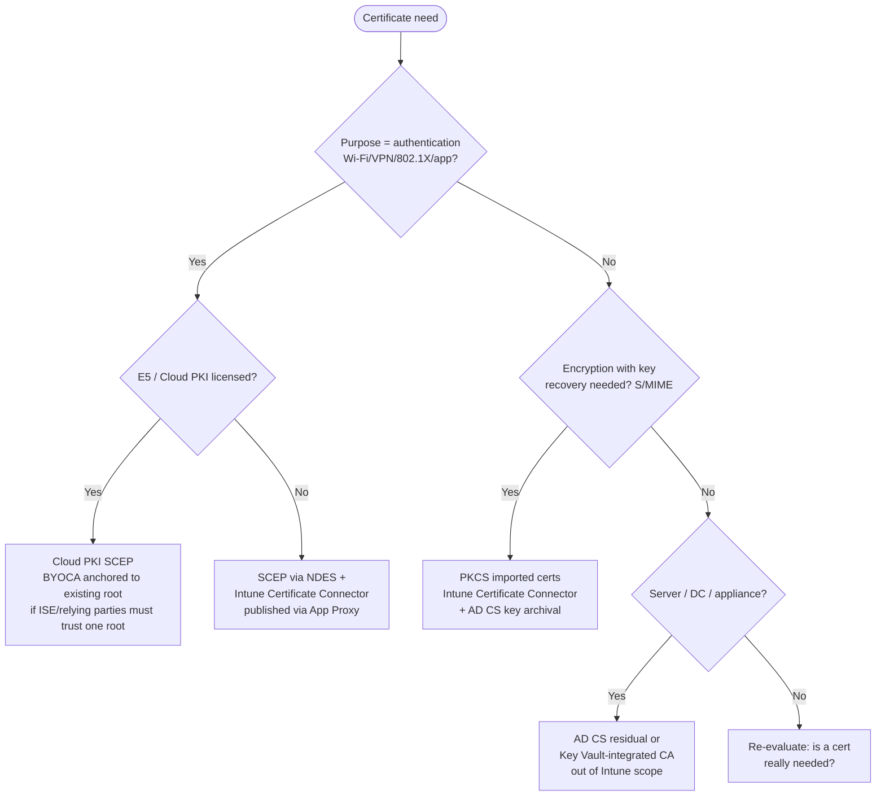

# 16. Certificate Migration Strategy

> **Part B: Workstream Plans** · Section 16 of 33 · Lead: Identity Team (PKI) + Network + Endpoint · **Critical path item** (§6.4)

## 16.1 Problem statement

Today, every AD-joined Windows device gets a **machine certificate through AD CS autoenrollment** (GPO). Users get user certificates the same way. Those certificates authenticate **Wi-Fi (EAP-TLS through Cisco ISE)**, **VPN**, and S/MIME. An **Entra-joined device has no AD computer account and doesn't process GPO, so it gets no certificate, can't join corporate Wi-Fi, and can't connect to VPN.** If this isn't solved before the IT pilot, the pilot fails on day 1.

## 16.2 Certificate consumer inventory (to complete M2)

| Use case | Subject | Current template | Consumers | Target issuance | Notes |
|---|---|---|---|---|---|
| Wi-Fi EAP-TLS (corporate SSID) | Device | `CH-Workstation-Auth` | ~11,000 Windows | **Cloud PKI SCEP (device)** | ISE trust + authZ rules |
| Wired 802.1X | Device | same | Clinical areas | Cloud PKI SCEP (device) | Intune *Wired network* profile |
| VPN (Cisco Secure Client) | Device | `CH-VPN-Device` | ~6,000 | Cloud PKI SCEP (device) or **retire with VPN** | Private Access needs no client cert |
| Wi-Fi on iOS/Android/macOS | Device/User | NDES absent → PSK today on some SSIDs ⚠️ | ~5,000 | Cloud PKI SCEP | Removes shared PSKs (security win) |
| Shared clinical badge/CBA | User | Badge vendor CA / AD CS smart card template | 1,900 | Entra **CBA** trusted CA (existing badge CA) | R-003 |
| S/MIME (signing/encryption) | User | `CH-SMIME` (key archival) | ~200 | **PKCS (imported or issued) through Intune Certificate Connector** | Key archival required → AD CS |
| Web server / TLS (internal) | Server | `CH-WebServer` | ~400 servers | AD CS (out of EUC scope); later Azure Key Vault + public/private CA | Datacenter program |
| Code signing (internal scripts, App Control) | User | `CH-CodeSign` | ~10 | AD CS or **Azure Trusted Signing** | |
| Domain controller / LDAPS | DC | `KerberosAuthentication` | DCs | AD CS (residual) | Required for LDAPS/Kerberos PKINIT |
| Medical devices / appliances | Device | Manual requests | Vendor-specific | AD CS (residual) | Out of Intune scope |
| WHfB | — | — | — | **None needed** (cloud Kerberos trust) | Avoids WHfB cert trust |

## 16.3 Decision framework: SCEP vs. PKCS vs. Cloud PKI

| Criterion | **Cloud PKI (SCEP)** | **SCEP via NDES + Cert Connector** | **PKCS via Cert Connector** | PKCS imported |
|---|---|---|---|---|
| Private key generation | On device (TPM-bound possible) | On device (TPM-bound possible) | **On connector/CA, then delivered** | Imported from escrow |
| On-prem infra | **None** (BYOCA optional, anchored to AD CS) | NDES server + connector + App Proxy publishing | Connector | Connector |
| Key archival / recovery | ❌ | ❌ | ✅ | ✅ |
| Best for | Device/user authentication (Wi-Fi, VPN, 802.1X) | Same, when Cloud PKI isn't licensed | Use cases needing a recoverable key | **S/MIME encryption on multiple devices** |
| Platforms | Windows, macOS, iOS/iPadOS, Android | All | All | All |
| Revocation | Automatic on device retire/wipe; CRL hosted by Intune | Through connector | Through connector | Through connector |
| Licensing | **[E5]** (July 2026) or Intune Suite / standalone | Included | Included | Included |
| Ops burden | Lowest | **Highest** (NDES is fragile, IIS, service account) | Medium | Medium |
| Security | Strongest (no on-prem RA exposed) | NDES is an attack surface | Key in transit (encrypted) | Escrowed key |

**Decision rule:**
- **Authentication certificates (device/user)** → **Cloud PKI** (if E5 per D-01). Otherwise SCEP through NDES, or a third-party cloud CA (e.g., SCEPman), as an explicit **[DECISION D-11]**.
- **Encryption certificates needing recovery (S/MIME)** → **PKCS imported** through the Intune Certificate Connector with AD CS key archival. Alternatively, **retire S/MIME in favor of Purview Message Encryption** (business decision).
- **Never** deploy the same purpose through both SCEP and PKCS to one device. That causes duplicate certs and ISE matching ambiguity.

## 16.4 Target PKI architecture

| Component | Design |
|---|---|
| **Root of trust** | **Option 1 (recommended for coexistence):** Cloud PKI **BYOCA** issuing CA, anchored to the existing **offline AD CS root**. ISE and other relying parties already trust the root, so you get one trust anchor and a smooth transition. **Option 2:** new Cloud PKI root + issuing CA, deployed to ISE and all relying parties as a new trust anchor (cleaner long-term; choose this if AD CS root retirement is planned in Phase 6) **[DECISION D-12]** |
| Issuing CAs | `CH-CloudPKI-Device-Issuing` (Wi-Fi/VPN/802.1X device certs), `CH-CloudPKI-User-Issuing` (user auth where needed) |
| Trusted certificate profiles | Root + issuing CA, per platform (Windows, macOS, iOS, Android) |
| SCEP profiles | Device cert: Subject `CN={{AAD_Device_ID}}`, SAN: URI `IntuneDeviceId://{{DeviceId}}` + DNS `{{DeviceName}}`; EKU Client Authentication; key storage **TPM (required on Windows)**; validity 1 year; renewal threshold 20 % |
| ISE | Trust root/issuing; certificate authentication profile matches SAN URI / CN (Entra device ID); authorization by **certificate issuer + optional Intune compliance lookup** (MDM integration); remove AD computer-group lookups for Entra-joined devices |
| Intune Certificate Connector | 2 servers (HA) for PKCS (S/MIME) and, if used, SCEP/NDES; current connector version; least-privilege service account; monitored |
| AD CS residual | Offline root + 1 issuing CA (servers, DCs, appliances, S/MIME); second issuing CA retired; templates rationalized (~60 → ~12) |
| CRL/AIA | Cloud PKI CDP/AIA hosted by Intune; AD CS CDP published to HTTP (not LDAP-only) so Entra-joined/off-network clients can check revocation |

## 16.5 Migration sequence

| Step | Month | Action | Validation |
|---|---|---|---|
| 1 | M2 | Consumer inventory complete; D-11/D-12 decided | Steering Committee sign-off |
| 2 | M3 | Cloud PKI CAs created (BYOCA CSR signed by offline root ceremony, if Option 1); CDP/AIA HTTP for AD CS | CA health in Intune |
| 3 | M3 | ISE lab: trust chain, auth profile, authZ policy for "Intune device cert" | Lab device authenticates |
| 4 | M4 | Trusted cert + SCEP + Wi-Fi profiles for Ring 0 | **Entra-joined Autopilot device joins corp Wi-Fi** ⭐ |
| 5 | M4 | Wired 802.1X profile for clinical test bench | Device authenticates on clinical switch port |
| 6 | M5–M6 | Ring 1–2: coexistence. Co-managed devices hold **both** the AD CS autoenrolled cert and the Cloud PKI cert. ISE accepts both issuers. Wi-Fi profile from Intune prefers the Intune cert (issuer filter in the profile). | ISE logs show issuer per auth |
| 7 | M6 | Mobile/macOS: replace PSK SSIDs with EAP-TLS (Cloud PKI) | PSK rotation then retirement |
| 8 | M7–M14 | Rings 3–5 | Auth success ≥ 99.5 % |
| 9 | M12 | Disable autoenrollment GPO for migrated OUs; revoke/let expire old machine certs | No AD CS machine cert issuance for Entra-joined devices |
| 10 | M13 | S/MIME through PKCS imported for the ~200 users (or retired) | Encrypted mail readable on Outlook mobile/desktop |
| 11 | M16 | Retire second AD CS issuing CA; template cleanup | AD CS footprint reduced |

## 16.6 Risks specific to certificates

| Risk | Mitigation |
|---|---|
| ISE can't match Entra-joined device (no AD object) | Match on cert SAN URI / Entra device ID; use the ISE Intune MDM compliance integration where the version supports it |
| Chicken-and-egg: device needs a cert to reach the network to get a cert | Onboarding SSID / internet-only VLAN for Autopilot OOBE; ESP waits for the cert profile before Wi-Fi switch |
| Certs issued before Cloud PKI HSM licensing (trial = software keys) | Don't take trial CAs to production; create production CAs only after licensing (HSM-backed) |
| CRL unreachable off-network for AD CS certs | HTTP CDP published externally or through Private Access |
| TPM attestation failures on older hardware | Fall back to software KSP only for a documented exception group |

## 16.7 RACI: Certificates

| Activity | ES | PM | AR | ID | EP | SE | AO | SD |
|---|---|---|---|---|---|---|---|---|
| Consumer inventory | I | I | C | **A/R** | R | C | C | I |
| D-11/D-12 PKI decisions | I | C | **A** | R | C | R | I | I |
| Cloud PKI / connector build | I | I | C | **A/R** | R | C | I | I |
| ISE integration | I | C | **A** | C | C | R | I | I |
| Intune cert/Wi-Fi/wired profiles | I | I | C | C | **A/R** | C | I | I |
| S/MIME decision & migration | C | I | C | R | R | **A** | C (Legal) | C |
| AD CS reduction | I | I | C | **A/R** | I | C | I | I |
