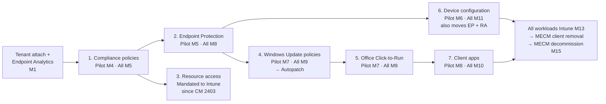
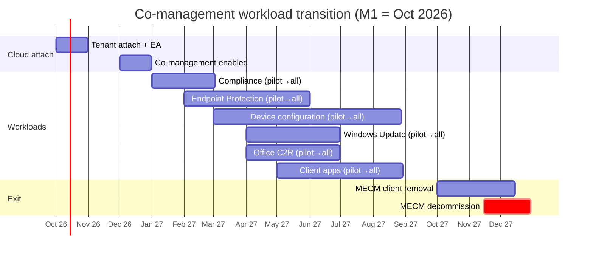

# 18. Co-Management Workload Transition Plan

> **Part B: Workstream Plans** · Section 18 of 33 · Lead: Endpoint Team · Related: §5.7 MECM decommission criteria, §10, §14

## 18.1 Co-management architecture (bridge)

| Element | Design |
|---|---|
| ConfigMgr version | **2609** (from M2). It must be ≥ 2603 before the October 2026 deprecation of an internal compliance service, which affects co-managed devices with the Compliance workload on Intune. |
| Cloud attach | **Tenant attach** (device upload of all devices, M1) → **Endpoint Analytics** upload → **co-management** (M3) |
| CMG | VM scale set CMG (M2) for internet-based clients during the bridge (patching, apps, inventory until workloads move) |
| Auto-enrollment | Co-management setting *Automatically enroll in Intune* = **Pilot** (M3, `CoMgmt-AutoEnroll-Pilot` collection) → **All** (M4) |
| Prerequisites per device | Hybrid Entra joined; MECM client current; Intune license; MDM user scope includes user; device not already MDM-enrolled elsewhere |
| Monitoring | Co-management dashboard; `CoManagementHandler.log`; Intune *co-managed* filter; Log Analytics workbook joining MECM SQL export + Intune Graph |

## 18.2 Collection model

| Collection | Purpose |
|---|---|
| `CoMgmt-AutoEnroll-Pilot` | Ring 0–1 devices for auto-enrollment |
| `CoMgmt-WL-<Workload>-Pilot` | One staging collection per workload (e.g., `CoMgmt-WL-WU-Pilot`) |
| `Wave-<n>` | Wave device membership (query: Intune ring extension attribute imported through Entra discovery or a direct rule from the wave tracker) |
| `Excl-PathD-Clinical` | Hybrid shared clinical devices, kept on a slower workload cadence |
| `MECM-Removal-Ready` | Devices meeting removal criteria (all workloads Intune + Entra joined) |

> Each workload's pilot collection is **independent**, so workloads can move at different speeds. Pilot collections should be *additive* (`Wave-1` + `Wave-2` included as waves pass), not replaced, which avoids flapping.

## 18.3 Workload sequence

## 18.4 Workload detail

### Workload 1: Compliance policies (first)

| Item | Detail |
|---|---|
| Why first | Lowest risk. Enables device-based Conditional Access for co-managed devices immediately. [MS-BP] (most customers switch this first) |
| Prereqs | Intune compliance policies (§10.5) built; CA in report-only; ConfigMgr ≥ 2603 |
| Configuration | Slider → Pilot Intune → Intune. In the Intune compliance policy, enable **"Require device compliance from Configuration Manager"** during the bridge so existing MECM compliance baselines still count. |
| Validation | Intune compliance state matches expectations for ≥ 98 % of the pilot collection; `ComplRelayAgent.log` shows the Intune authority |
| Rollback | Slider back to Configuration Manager (instant; CA policies remain report-only for that ring) |
| Risk | Devices showing non-compliant because of a missing BitLocker escrow / TPM → fix before CA enforcement |

### Workload 2: Endpoint Protection

| Item | Detail |
|---|---|
| Scope | Defender AV, Firewall, BitLocker (Disk encryption), Exploit protection, Application control, ASR, Account protection (from Intune endpoint security) |
| Prereqs | Intune endpoint security policies; **BitLocker recovery keys escrowed to Entra** for 100 % of the pilot; MECM Endpoint Protection policies documented; MBAM client policy removal plan |
| Order | Pilot = IT ring, then waves. **Don't** leave MECM antimalware policies assigned to the same devices (conflicts). |
| Validation | Defender portal: AV mode, signature age, tamper protection; Intune encryption report; firewall profile status |
| Rollback | Slider back; MECM antimalware policies re-apply (keep them deployed but scoped to the remaining collection until 100 %) |
| Note | Switching **Device configuration** later *also* switches Endpoint Protection and Resource access. That's fine if EP is already moved. To **remove tattooed EP settings**, the Device configuration workload must also be switched. |

### Workload 3: Resource access policies

| Item | Detail |
|---|---|
| Status | **Removed from ConfigMgr since 2403.** The slider is mandated to Intune. VPN/Wi-Fi/email/certificate profiles are delivered by Intune (§16). |
| Action | Confirm no legacy resource-access objects remain (2403+ prerequisite check). Build Intune Wi-Fi/VPN/cert profiles and assign them to co-managed devices in the pilot rings. |

### Workload 4: Windows Update policies (→ Windows Autopatch)

| Item | Detail |
|---|---|
| Prereqs | Autopatch tenant enrollment; Autopatch groups mapped to rings. **Autopatch prerequisite for co-managed devices: the Windows Update, Device configuration, and Office Click-to-Run workloads must all be Intune (or Pilot Intune including the device).** So for each ring these three workloads move **together**, and a ring joins Autopatch only after its Device configuration cutover (§14). Until then, the ring gets WUfB policies directly from Intune (update rings / feature update policies) without Autopatch registration. |
| MECM client setting | For the collection: **Software Updates → Enable software updates on clients = No** (custom client setting, higher priority) |
| Remove | SUP deployments / ADRs targeting those collections; WSUS GPO settings (`WUServer`) unlinked (they make the device scan WSUS) |
| Validation | WUfB reports: devices reporting, policy applied; `WUAHandler.log` shows the WUfB source; no `WUServer` registry value present |
| Rollback | Slider back + re-enable the client setting; ADRs still exist until M12 |
| Clinical | Ring 5 with restart windows aligned to clinical units; **Expedite** policy for zero-days with Steering-approved fast path |

### Workload 5: Office Click-to-Run apps

| Item | Detail |
|---|---|
| Scope | M365 Apps deployment + updates |
| Prereqs | Intune M365 Apps policy (channel: Monthly Enterprise), Office cloud policy service for user settings, Autopatch M365 Apps management |
| Validation | M365 Apps health in M365 Apps admin center (config.office.com); channel and version distribution |
| Rollback | Slider back; MECM Office 365 Client Management continues |

### Workload 6: Device configuration

| Item | Detail |
|---|---|
| Scope | All configuration profiles (settings catalog, templates, scripts?). **Settings catalog policies follow this slider regardless of content.** |
| Prereqs | §14 complete for the ring (GPA migration, baselines); MECM configuration baselines reviewed. Baselines that must remain: mark **"Always apply this baseline even for co-managed clients."** |
| GPO | GPO unlink/security-filter for the ring on cutover day (§14.3) |
| Validation | Intune profile status ≥ 98 % success; no conflicts; user experience checks (Start, Edge, OneDrive, power) |
| Rollback | Slider back + relink GPO (GPO backups kept); re-test |
| Path D | Shared clinical devices move last (after the clinical pilot exit) |

### Workload 7: Client apps

| Item | Detail |
|---|---|
| Scope | App deployments from Intune to co-managed devices; Company Portal shows **both** MECM and Intune apps when the workload is Intune (unified catalog) |
| Prereqs | §11 wave app readiness ≥ 98 %; Win32 apps assigned; **MECM required deployments for the same apps removed** (avoid double-install / version fights) |
| Software Center | Communicate the move to **Company Portal**; pin the Company Portal on the taskbar; retire Software Center links |
| Validation | Install success ≥ 97 %; no duplicate installs; user-available app catalog parity |
| Rollback | Slider back; MECM deployments re-enabled from backup |

## 18.5 MECM exit sequence

| Step | Month | Action |
|---|---|---|
| 1 | M13 | All 7 workloads = Intune for **all** collections (Path D included) |
| 2 | M13 | Freeze: no new MECM deployments; change board rejects MECM changes |
| 3 | M13–M14 | **MECM client removal** on Entra-joined devices (Path B devices are already clean after wipe; Path A never had it). For any remaining co-managed devices: Intune remediation running `ccmsetup.exe /uninstall` + cleanup (`C:\Windows\CCM`, `ccmcache`, `SMSCFG.ini`, certificate store `SMS`). **Hybrid devices remaining (Path D) can run without the MECM client as Intune-only Hybrid devices.** |
| 4 | M14 | Remove co-management policy; validate devices still enrolled in Intune (MDM enrollment persists without the ConfigMgr client) |
| 5 | M14 | Reporting cut-over accepted (§5.7 gate #4) |
| 6 | M15 | **Decommission gate** (§5.7) → remove CMG, DPs, SUP/WSUS, site roles; uninstall site; archive DB backup (immutable storage, 12 months); remove AD schema/System Management container permissions (keep the schema extension, it's harmless) |
| 7 | M15 | Remove PXE options 66/67 from DHCP; remove boot images; update the asset/CMDB source of truth to Intune + MDE |

## 18.6 Monitoring and KPIs per workload

| KPI | Source | Threshold to promote pilot → all |
|---|---|---|
| Workload authority = Intune on targeted devices | Co-management dashboard / `CoManagementHandler.log` | ≥ 99 % |
| Policy success | Intune reports | ≥ 98 % |
| Incident delta vs. control group | ITSM (category `CoMgmt-<Workload>`) | ≤ +10 % for 10 business days |
| Security posture | Defender / compliance | No regression |
| Patch compliance (WU workload) | WUfB reports | ≥ 95 % within the deadline |

## 18.7 RACI: Co-management workload transition

| Activity | ES | PM | AR | ID | EP | SE | AO | SD |
|---|---|---|---|---|---|---|---|---|
| Cloud attach / CMG / co-management enablement | I | I | C | C | **A/R** | C | I | I |
| Compliance workload | I | I | C | I | R | **A** | I | C |
| Endpoint Protection workload | I | I | C | I | R | **A** | I | C |
| Windows Update / Autopatch | I | I | C | I | **A/R** | C | C | C |
| Office C2R | I | I | C | I | **A/R** | I | C | C |
| Device configuration | I | I | C | C | **A/R** | C | I | C |
| Client apps | I | I | C | I | **A/R** | I | C | R |
| Promote pilot → all (per workload) | I | C | **A** | C | R | C | C | C |
| MECM decommission | **A** (gate) | R | C | I | R | C | I | I |

---

**End of Part B.** Next: **Part C: Execution, starting with §19 Pilot Deployment Plan.**
