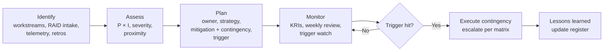

# 27. Risk Mitigation Strategy

> **Part D: Risk, Compliance, Governance** · Section 27 of 33 · Related: §26 register, §22 rollback, Risk Analysis section

## 27.1 Risk appetite statement (proposed for Steering Committee approval)

| Domain | Appetite | Meaning |
|---|---|---|
| **Patient safety** | **Zero** | No migration activity proceeds where a credible patient-safety impact is unmitigated. The clinical co-sponsor holds veto. |
| **Regulatory / PHI privacy** | **Very low** | PHI exposure risks need a mitigation in place *before* the change, not after. |
| **Security (cyber)** | **Low** | Temporary security exceptions are allowed only with expiry ≤ 90 days, a compensating control, and SE approval. |
| **Schedule** | **Moderate** | We'll trade schedule for safety and quality. Slips up to 2 months are acceptable without re-baselining the program. |
| **Cost** | **Moderate** | ±10 % variance tolerance per budget category (§30) before escalation. |
| **User experience** | **Moderate** | Temporary degradation during hypercare is acceptable. Persistent regression is not. |

## 27.2 Mitigation strategies by type

| Strategy | When used | Program examples |
|---|---|---|
| **Avoid** | Remove the activity that creates the risk | Don't build new Hybrid-joined devices (D-02); don't migrate cold data (D-05); don't use NDES if Cloud PKI is licensed |
| **Reduce probability** | Prevent the risk from occurring | Report-only CA, test tenant, pilots, dependency telemetry, readiness gates |
| **Reduce impact** | Limit the damage if it happens | Ring-based deployment, wave size caps, spare device pool, warm standby AD FS, read-only shares, multi-admin approval |
| **Transfer** | Shift to a party better placed to manage it | Partner SOWs with acceptance criteria; vendor certification commitments in contracts; cyber insurance; Microsoft Unified Support |
| **Accept** | Residual risk within appetite, explicitly owned | Path D exceptions with review dates; residual AD for medical devices |

## 27.3 Risk management process

| Cadence | Forum | Scope |
|---|---|---|
| Weekly | Workstream leads RAID review (30 min) | New risks, trigger status, actions |
| Bi-weekly | Design Authority | Technical risks, exceptions, architecture decisions |
| Monthly | Steering Committee | Top-10 risks, Critical risks, appetite breaches, decisions needed |
| Per wave | Go/no-go | Wave-specific risks |
| Quarterly | Audit/Risk committee (enterprise) | Program risk posture |

**Escalation matrix**

| Severity | Escalate to | Within |
|---|---|---|
| Critical (new or trigger hit) | PM → Executive Sponsor (+ CMIO if clinical) | 24 h |
| High | PM → Steering Committee (next meeting, or ad hoc if a trigger is hit) | 5 business days |
| Medium | Workstream lead → PM | Weekly review |
| Low | Workstream lead | Monthly review |

## 27.4 Key Risk Indicators (KRIs)

| KRI | Linked risks | Green | Amber | Red (trigger) |
|---|---|---|---|---|
| Win10 devices without ESU or upgrade path | R-001 | 0 | 1–50 | > 50 |
| Open priority ≥ 60 dependencies for the next wave | R-002 | 0 | 1–3 | > 3 at T-2 weeks |
| Badge-tap vendor certification status | R-003 | Certified | In testing | Not started by M4 |
| Oversharing report: PHI-labeled items shared org-wide/anonymous | R-004 | 0 | 1–10 | > 10 or any anonymous |
| Clinical pulse score | R-005 | ≥ 4.0 | 3.5–4.0 | < 3.5 |
| CA sign-in failures (CA-caused) per day vs. baseline | R-010 | ≤ 1.1× | 1.1–1.5× | > 1.5× |
| Exclusions in CA groups past expiry | R-013 | 0 | 1–5 | > 5 |
| Wi-Fi cert auth success | R-018 | ≥ 99.5 % | 99–99.5 % | < 99 % |
| Wave app readiness | R-020 | ≥ 98 % | 95–98 % | < 95 % at T-2 weeks |
| Clinic WAN utilization during wave | R-023 | < 70 % | 70–85 % | > 85 % sustained 15 min |
| Program FTE capacity vs. plan | R-030 | ≥ 95 % | 85–95 % | < 85 % |
| Incidents per migrated device (10 days) | R-035 | ≤ 3 % | 3–5 % | > 5 % |

## 27.5 Mitigation plans: top Critical risks

### R-001 Windows 10 ESU expiry
| Step | When | Owner |
|---|---|---|
| Count Win10 devices; classify capable/incapable; refresh dates | Week 1 | EP |
| Purchase ESU Year 2 licenses for the residual population; deploy MAK/activation (Intune script/remediation) | Week 1–2 | Procurement + EP |
| Win11 feature update policy (Intune/co-mgmt) for capable devices | M1–M3 | EP |
| Replacement procurement for ~900 incapable devices (Autopilot OEM-registered) | M1–M6 | Procurement |
| KRI tracking weekly until 0 | Ongoing | PM |

### R-002 Hidden authentication dependencies
| Step | When | Owner |
|---|---|---|
| MDI + NTLM/LDAP audit + DNS logging on | M1 | ID/SE |
| 60-day dependency register built and scored | M3 | ID |
| Cloud Kerberos trust + Private Access proven against the top 20 Kerberos apps | M4 | ID + EP |
| Wave clearance gate enforced | M8+ | AR |
| DC consolidation only after per-DC consumer count = 0 | M12+ | ID |

### R-004 PHI oversharing in migration
| Step | When | Owner |
|---|---|---|
| Sensitivity labels and DLP policies live before the first share migration | M5 | SE |
| Permission model (no "Everyone except external users" on PHI sites) | M5 | Data |
| Pre-migration ACL review with data owners | Per share | AO |
| Post-migration oversharing scan (SharePoint Advanced Management/DSPM where licensed, or scripted Graph report) | T+5 days | Data |
| Breach assessment process with Privacy Officer pre-agreed | M5 | Compliance |

### R-005 Clinical change fatigue
| Step | When | Owner |
|---|---|---|
| Clinical co-sponsor and nursing council engagement | M1–M2 | ES |
| Blackout calendar agreed | M3 | PM |
| Super-user network recruited (≥ 2 per unit/shift) | M5–M7 | Change |
| Single-touch bundling per unit | M7+ | EP |
| Pulse surveys; pause rule if score < 3.5 | Per wave | Change |

### R-006 Entra Connect version
| Step | When | Owner |
|---|---|---|
| Verify version and sync health (Connect Health, `Get-ADSyncScheduler`) | Day 1 | ID |
| Upgrade active + staging to current version | Week 1 | ID |
| Enable auto-upgrade where eligible; subscribe to version deprecation notices | Week 1 | ID |

### R-010 / R-013 CA lockout and transition-period attack surface
| Step | When | Owner |
|---|---|---|
| Report-only first, what-if, Maester regression suite | Every change | SE |
| Exclusion group governance (owner, expiry, access review quarterly) | M3+ | SE |
| Sentinel detections on AD FS, Connect, CMG, CA changes, break-glass | M3 | SE |
| Tabletop: CA lockout + compromised admin | M4, M10 | SE |

### R-018 Certificates for Entra-joined devices
| Step | When | Owner |
|---|---|---|
| D-11/D-12 decisions | M2 | AR |
| ISE lab integration | M3 | Network |
| First Entra-joined device on corporate Wi-Fi (milestone) | M4 | ID + EP |
| Coexistence (dual cert) through waves | M5–M14 | EP |

### R-029 / R-030 People capacity
| Step | When | Owner |
|---|---|---|
| Knowledge capture sprint (MECM, AD, PKI, AD FS); runbook library | M1–M2 | PM |
| Backfill hiring / partner staff augmentation | M1–M3 | ES |
| Protected time policy: program staff ≤ 20 % BAU | M2+ | ES |
| Retention plan for key engineers (certifications, role progression) | M2 | ES + HR |

## 27.6 Contingency reserve

| Reserve | Amount (indicative) | Release authority |
|---|---|---|
| Schedule contingency | 2 months (built into M18; Phase 5 can absorb) | Steering Committee |
| Budget contingency | 10–15 % of one-time costs (§30) | Executive Sponsor |
| Capacity contingency | Partner surge clause (+4 FTE for 3 months) | PM |
