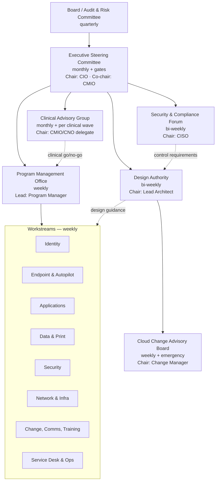

# 31. Governance Model

> **Part D: Risk, Compliance, Governance** · Section 31 of 33 · Owner: Executive Sponsor + Program Manager · Structure diagram also in Appendix J

## 31.1 Governance structure

## 31.2 Forum charters

| Forum | Members | Purpose | Decision rights | Inputs | Outputs |
|---|---|---|---|---|---|
| **Executive Steering Committee** | CIO (chair), CMIO (co-chair), CNO, CFO delegate, CISO, COO delegate, Compliance Officer, PM (secretary), Lead Architect | Strategic direction, funding, phase gates, top risks | Approve phase gates, budget release, D-xx decisions, risk acceptance (High/Critical), scope changes | Executive dashboard (App-E), gate scorecards, decision papers | Decisions log, actions |
| **Design Authority** | Lead Architect (chair), workstream tech leads (ID, EP, SE, Network, Data), Microsoft/partner architects (advisory) | Architecture integrity, standards, exceptions | Approve designs, standards, technical exceptions (time-boxed), Medium technical risks | Design papers, exception requests, test results | ADRs (architecture decision records), standards |
| **PMO** | PM, workstream leads, change lead, finance | Integrated plan, RAID, resources, reporting | Schedule adjustments within tolerance (≤ 2 weeks), resource allocation within the program | Workstream status, RAID | Integrated plan, status report, RAID |
| **Cloud CAB** | Change manager (chair), EP, ID, SE, Network, SD, clinical IT liaison | Production change control for Intune, Entra, CA, Azure | Approve normal/emergency changes; standard change catalog | Change requests with test evidence and rollback | Approved changes, change calendar |
| **Clinical Advisory Group** | CMIO/CNO delegates, nurse managers, clinical informatics, pharmacy, lab, imaging | Clinical safety and workflow | **Veto** on clinical waves, blackout calendar, clinical exceptions | Clinical pilot results, wave plans | Clinical go/no-go, safety actions |
| **Security & Compliance Forum** | CISO (chair), Privacy Officer, Compliance, SE leads, AR | Control design, compliance evidence, security exceptions | Approve security exceptions (≤ 90 days), CA policy design, compliance mappings | Secure Score, exceptions register, assessor feedback | Security decisions, exception approvals |

## 31.3 Decision rights (RAPID-style summary)

| Decision | Recommend | Agree | Perform | Input | Decide |
|---|---|---|---|---|---|
| Phase gate go/no-go | PM | CISO, CMIO | Workstreams | AR, SD | **Steering Committee** |
| Wave go/no-go | PM | Clinical lead (clinical waves), SD lead | EP, Data | AO | **PM** (with vetoes per §20.5) |
| Architecture standard | AR | SE | Workstreams | Microsoft/partner | **Design Authority** |
| Technical exception (≤ 90 days) | Workstream lead | SE | Workstream | AO | **Design Authority** |
| Security exception | Requestor | AR | SE | Compliance | **Security & Compliance Forum** |
| Production change | Engineer | Peer reviewer | Engineer | SD | **Cloud CAB** (standard changes pre-approved) |
| Licensing / budget | PM | CFO delegate | Procurement | AR | **Executive Sponsor** |
| Clinical blackout / clinical exception | Clinical informatics | CNO | PM | EP | **Clinical Advisory Group** |
| Risk acceptance (High/Critical) | Risk owner | CISO | — | PM | **Steering Committee** |

## 31.4 Decision log (open decisions from the blueprint)

| ID | Decision | Section | Needed by | Forum |
|---|---|---|---|---|
| D-01 | Licensing uplift (E5 KW/admins; frontline security add-on) | §29 | M2 | Steering |
| D-02 | No new Hybrid-joined devices after M6 | §5, §17 | M2 | Steering |
| D-03 | Defederate AD FS by M10 | §9 | M3 | Steering |
| D-04 | Hardware-refresh-aligned conversion funding | §5.3 | M2 | Steering |
| D-05 | Archive/delete cold data (> 3 yrs) | §12.6 | M3 | Steering + Legal |
| D-06 | Clinical blackout calendar | §23 | M3 | Clinical Advisory |
| D-07 | Resourcing / backfill (6 FTE + partners) | §30 | M1 | Steering |
| D-08 | macOS: Intune vs. Jamf Cloud | §10.3.5 | M5 | Design Authority |
| D-09 | MECM retention (confirm decommission) | §5.7 | M9 | Steering |
| D-10 | VDI platform (AVD/W365/Citrix DaaS) | §10.3.4 | M9 | Steering |
| D-11 | Cloud PKI vs. NDES/third-party | §16 | M2 | Design Authority |
| D-12 | PKI trust anchor (BYOCA vs. new root) | §16 | M2 | Design Authority |
| D-13 | Workforce commitment (no automation-driven layoffs) | §23.5 | M2 | Steering + HR |
| D-14 | Phase 6 AD retirement business case | §15.8 | M18 | Steering |

## 31.5 Policy-as-code and change governance

| Element | Standard |
|---|---|
| Source of truth | Git repository (Azure DevOps/GitHub) holding Intune, Entra CA, and authentication methods configuration exports |
| Change flow | Change in test tenant → export → PR with diff + test evidence → peer review (2 approvers for CA/compliance) → CAB (normal) or pre-approved (standard) → production import or manual apply → post-change export verifies parity |
| Standard changes (pre-approved) | App update supersedence to Ring 0–2; adding devices to existing groups; new Win32 app to "Available"; Universal Print printer additions |
| Normal changes | New/changed configuration profiles, compliance, Autopatch ring changes, app Required assignments |
| High-risk changes (CAB + Security Forum) | CA policies, authentication methods, compliance policy settings that affect access, tenant-wide settings, RBAC |
| Emergency changes | Zero-day mitigations (expedited updates, ASR rules), CA rollback. Post-implementation review within 48 h. |
| Drift detection | Daily export compared to Git; drift → ticket to owner |

## 31.6 Reporting cadence

| Report | Audience | Frequency | Content |
|---|---|---|---|
| Executive dashboard | Steering, ES | Monthly (live in Power BI) | Milestones, KPIs (§4.2), top risks, budget, decisions needed |
| Program status report | PMO, workstream leads | Weekly | RAG per workstream, plan vs. actual, RAID changes |
| Technical dashboard | DA, engineering | Live | Enrollment, compliance, Autopilot, workloads, apps, updates (App-F) |
| Wave report | PMO, business owners | Per wave | Wave KPIs, incidents, CSAT |
| Benefits report | Steering, CFO | Quarterly | Savings realized, productivity KPIs |
| Compliance evidence pack | Compliance, assessors | Quarterly | Control evidence exports |

## 31.7 Program RACI (governance level)

| Activity | ES | PM | AR | ID | EP | SE | AO | SD |
|---|---|---|---|---|---|---|---|---|
| Program charter & funding | **A** | R | C | I | I | C | I | I |
| Integrated plan & RAID | I | **A/R** | C | R | R | R | C | C |
| Architecture & standards | I | C | **A/R** | R | R | R | C | I |
| Phase gate decisions | **A** | R | R | C | C | C | C | C |
| Change control (CAB) (Change Manager sits in the PMO) | I | **A** | C | R | R | R | I | R |
| Benefits realization | **A** | R | C | I | C | I | C | C |
