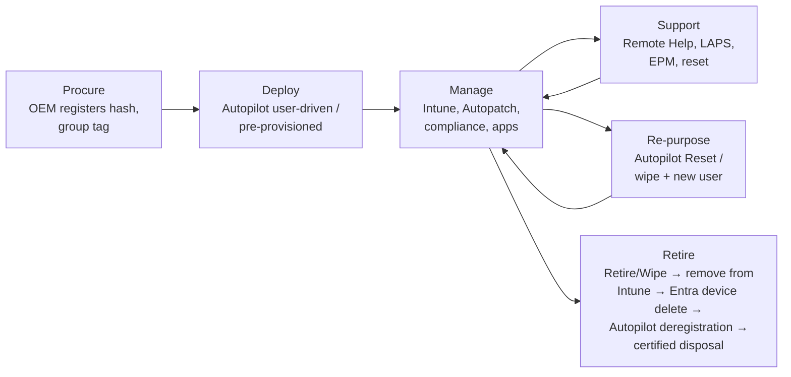

# 32. Operational Support Model

> **Part D: Risk, Compliance, Governance** · Section 32 of 33 · Owner: Service Desk Lead + Endpoint Engineering Lead · Effective from first pilot (M5); BAU handover M18

## 32.1 Target operating model

The operating model moves from **"server and image administration"** to **"cloud service and experience management"**:

| Old (on-prem) activity | New (cloud) activity |
|---|---|
| Patch servers, maintain DPs/SUP/WSUS | Manage Autopatch rings, release health, expedite decisions |
| Build and maintain OSD images/task sequences | Maintain Autopilot profiles, ESP, app catalog |
| GPO edits | Configuration-as-code PRs through CAB |
| MECM site health | Intune service health, connector health, Message Center triage |
| Desk-side reimage | Remote Autopilot reset / wipe; spare swap |
| Remote control (MECM) | Remote Help |
| Manual compliance evidence | Automated exports and dashboards |

## 32.2 Support tiers

| Tier | Team | Scope | Tools / permissions (Intune RBAC) |
|---|---|---|---|
| **Tier 0: Self-service** | Users | SSPR, WHfB PIN reset, Company Portal installs, OneDrive restore, BitLocker key (My Account, if policy allows), EPM elevation request, device sync | My Account, Company Portal, OneDrive |
| **Tier 1: Service Desk** | 30 analysts (24×7 for clinical) | Sign-in issues, TAP issuance, MFA re-registration, basic device actions (sync, restart), BitLocker key retrieval, Remote Help (view), KB-driven fixes | `SD-Tier1` role, Authentication Administrator (scoped through administrative units), Remote Help helper (view) |
| **Tier 2: Desktop / Endpoint Support** | 40 (regional + desk-side) | Autopilot failures, app install issues, LAPS retrieval, Autopilot reset/wipe (with MAA for bulk), Remote Help full control + elevation, printer issues, mobile enrollment | `SD-Tier2` role, Remote Help full, LAPS read, Autopilot reset |
| **Tier 3: Endpoint Engineering** | 12 (Intune, packaging, Autopatch, macOS/mobile) | Policy/app/profile issues, root cause, config changes (through CAB), Autopatch release decisions, Graph automation | `EP-Intune-Engineer`, `EP-App-Packager` |
| **Tier 3: Identity Engineering** | 6 | CA, sync, WHfB/Kerberos, PKI, Private Access | Entra roles through PIM |
| **Tier 3: Security Operations** | SOC 24×7 (internal or MSSP) | Defender incidents, Sentinel, device isolation, EPM rule reviews | Defender/Sentinel roles |
| **Tier 4: Vendors** | Microsoft Unified Support, partner, OEMs, app vendors | Product defects, service incidents | Support contracts |

## 32.3 Service catalog (selected)

| Service | Request/incident | SLA (P3 default) | Fulfillment |
|---|---|---|---|
| New device (new hire) | Request | Ready by start date (order T-10 business days) | OEM-registered Autopilot, shipped/delivered |
| Device replacement (break/fix) | Incident | Next business day (clinical: 2 h swap from spare pool) | Spare pool; Autopilot |
| Device rebuild | Incident | 4 h | Remote wipe / Autopilot reset |
| Application install (catalog) | Request | Self-service immediate | Company Portal |
| New application (packaging) | Request | 15 business days (standard), 5 (expedited) | Packaging team |
| Admin elevation (EPM) | Request | 15 min (support-approved, business hours); 1 h after hours | Tier 2 approvers |
| Access to SharePoint site | Request | 1 business day | Site owner (self-service) |
| Lost/stolen device | Incident | Retire/wipe within 1 h of report | Tier 1 + security notification |
| MFA/WHfB reset | Incident | 30 min | Tier 1 (TAP) |

## 32.4 Monitoring and alerting

| Signal | Source | Alert to | Threshold |
|---|---|---|---|
| Microsoft service incidents (Intune, Entra, Exchange, Teams, SPO, Autopatch) | M365 Service Health (Graph `serviceAnnouncement`) → Teams/ITSM | SD lead, EP on-call | Any incident affecting tenant |
| Message Center changes | Message Center → Planner sync / weekly triage | EP lead, ID lead | Weekly review; Major Changes within 48 h |
| Autopatch release health / alerts | Autopatch reports | EP | Any paused release or failure > 5 % |
| Compliance drop | Intune / Log Analytics query | EP | Compliance < 95 % or −2 % day-over-day |
| Autopilot failure rate | Autopilot report → Log Analytics | EP | > 5 % daily |
| Certificate connector / Private Network Connector / Cloud Sync agent / Entra Connect health | Intune connector status, Entra Connect Health, Private Access connector status | ID / EP | Any connector inactive > 15 min |
| APNs / ABM / ADE token / VPP token / Managed Google Play / Autopilot (OEM) expiry | Intune connectors and tokens | EP | **30 days before expiry** (APNs expiry = all iOS management broken) |
| Defender for Endpoint sensor health | Defender | SE | Inactive sensors > 1 % |
| Sentinel high-severity incidents | Sentinel | SOC | Per playbook |
| Break-glass sign-in | Sentinel | SOC + ID lead | Any |
| Device/user license assignment errors | Entra | Licensing | Any |

## 32.5 BAU operational routines

| Cadence | Routine | Owner |
|---|---|---|
| Daily | Service Health review; Autopilot/ESP failures; compliance exceptions; connector health; overnight Sentinel incidents; EPM pending requests | EP / SD / SOC |
| Weekly | Message Center triage; Patch Tuesday readiness (second Tuesday) + Autopatch ring progress; app update review (EAM catalog updates); stale device cleanup preview; CAB | EP |
| Monthly | Intune service release (`YYMM`) notes review; Windows release health; drift report; KPI dashboard; license reconciliation; Endpoint Analytics review; security baseline version review | EP lead |
| Quarterly | Access reviews (admin roles, exclusions); DR tests per schedule; Autopilot device hygiene; token/certificate expiry review; KB review; CA policy review | ID / SE / EP |
| Annually | Baseline refresh (new Windows feature update); RBAC model review; lifecycle review of apps; DR full test; pen test | All |

## 32.6 Device lifecycle (cloud-native)

Stale device cleanup: Intune device cleanup rules (no check-in > 90 days), Entra stale device report (disable > 90, delete > 180), Autopilot records kept until physical disposal.

## 32.7 Knowledge management

| Element | Standard |
|---|---|
| KB structure | Symptom-based titles; resolution steps; tier; owning team; review date (6 months) |
| Runbooks | Engineering runbooks in Git/wiki next to config-as-code; one per operational procedure (e.g., "Rotate APNs certificate", "Promote Entra Connect staging server", "Pause Autopatch ring") |
| Lessons learned | Captured per wave, pushed into KB/runbooks within 5 days |

## 32.8 Operational KPIs (BAU)

| KPI | Target |
|---|---|
| First-contact resolution (Tier 1) | ≥ 70 % |
| Mean time to provision (new device) | < 4 h from power-on |
| Device compliance | ≥ 97 % |
| Patch currency (quality update within 14 days) | ≥ 95 % |
| Autopilot success | ≥ 98 % |
| Tickets per 100 users per month | ≤ 22 |
| Remote Help resolution share of device incidents | ≥ 50 % |
| CSAT | ≥ 4.3/5 |

## 32.9 RACI: Operations (BAU)

| Activity | ES | PM | AR | ID | EP | SE | AO | SD |
|---|---|---|---|---|---|---|---|---|
| Tier 1/2 support | I | I | I | C | C | I | I | **A/R** |
| Intune/Autopilot/Autopatch operations | I | I | C | C | **A/R** | C | I | C |
| Identity operations (CA, sync, PKI) | I | I | C | **A/R** | C | C | I | C |
| Security operations | I | I | C | C | C | **A/R** | I | C |
| App lifecycle | I | I | I | I | R | C | **A** | C |
| Token/connector expiry management | I | I | I | R | **A/R** | I | I | I |
| BAU handover acceptance (M18) | **A** | R | C | R | R | R | I | R |
