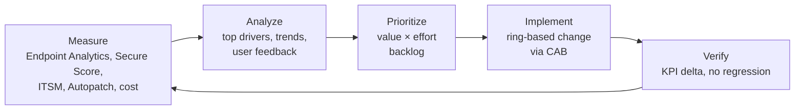

# 33. Post-Migration Optimization

> **Part D: Risk, Compliance, Governance** · Section 33 of 33 · Window: Phase 5 (M15–M18) and continuing BAU · Owner: Endpoint Engineering Lead + Architect

Migration gets you to the cloud. Optimization is what delivers the business case. The first 6 months after the last wave are where most of the user-experience and security gains are realized, or quietly lost to drift.

## 33.1 Optimization backlog by domain

### 33.1.1 Endpoint experience

| Item | Tool | Target |
|---|---|---|
| Boot and sign-in performance | **Endpoint Analytics** startup performance; identify slow models, GP-processing leftovers, heavy startup apps | Endpoint Analytics score ≥ 75; boot-to-desktop −35 % vs. baseline |
| App reliability | Endpoint Analytics app reliability; crash trends by app version | Top-10 crashing apps actioned |
| Proactive remediation | **Remediations** library: disk cleanup, stuck OneDrive sync, Teams cache, network adapter power settings, printer queue reset, time sync | ≥ 20 remediations with measured incident reduction |
| Anomaly detection & device timeline | **Advanced Analytics** **[E3+]** | Weekly anomaly review |
| Battery health / hardware refresh targeting | Advanced Analytics battery health; Resource performance | Refresh driven by data, not age alone |
| Work From Anywhere | Endpoint Analytics *Work from anywhere* report (cloud management, cloud identity, cloud provisioning, Windows) | ≥ 90 |

### 33.1.2 Configuration hygiene

| Item | Action |
|---|---|
| Policy consolidation | Merge overlapping settings catalog profiles; remove pilot-era duplicates; target ≤ 60 Windows profiles total |
| Remediation script debt | Each script from the GPO gap register (§14) reviewed: is there a CSP now? Retire if yes. |
| Assignment model | Replace static groups with filters + dynamic groups; remove nested groups |
| Baseline versions | Upgrade to the latest Security Baseline versions; document deviations |
| Exclusion cleanup | CA exclusions, compliance exclusions, ASR exclusions: each has an owner and expiry; remove expired |
| Hybrid stragglers | Path D review: convert, or renew the exception with a signed justification |

### 33.1.3 Security posture

| Item | Target |
|---|---|
| Secure Score improvement actions | ≥ 75 % (§13.7), then ≥ 80 % in year 2 |
| Exposure management | Defender Vulnerability Management: critical CVEs remediated within 14 days (Autopatch + EAM) |
| Token protection, Continuous Access Evaluation strict enforcement | Pilot → broad |
| Phishing-resistant only for all users | Remove MFA methods weaker than passkey/WHfB/FIDO2/CBA for workforce |
| Least privilege | EPM elevation analytics → convert frequent support-approved elevations into rules or fix apps to not need admin |
| App Control for Business | Expand from kiosks/PAWs to standard devices in audit → enforce (managed installer) |
| NTLM reduction | §15.7 continuation |
| Purple-team exercise | M17 and annually |

### 33.1.4 Cost

| Item | Action |
|---|---|
| License right-sizing | Inactive users, persona drift, E5 feature adoption review; reclaim unused add-ons |
| Azure | Reserved instances / savings plans for steady VMs; right-size AVD hosts (autoscale scaling plans); Sentinel table tiers |
| Tool rationalization | Retire overlapping tools (remote support, third-party patching, imaging tools, legacy SIEM, Jamf on-prem) |
| Print | Universal Print usage analytics → remove under-used printers |

### 33.1.5 Operations and automation

| Item | Action |
|---|---|
| Graph automation | Device lifecycle (stale cleanup, Autopilot dereg on disposal), group tag assignment, reporting exports |
| Copilot in Intune / Security Copilot | Policy analysis, device troubleshooting summaries, KQL generation, **subject to BAA/licensing confirmation (§28.3)** |
| Self-service expansion | Self-service BitLocker key, self-service Autopilot reset guidance, Company Portal app coverage ≥ 90 % |
| ITSM integration | Intune ↔ ITSM device sync, auto-ticket on non-compliance > 7 days |

## 33.2 Continuous improvement cycle

Monthly **Experience & Posture Review** (EP lead, ID lead, SE lead, SD lead): top-5 experience issues, top-5 security improvement actions, cost opportunities, backlog re-prioritization.

## 33.3 Year-2 roadmap (beyond the program)

| Theme | Initiatives |
|---|---|
| **Cloud-only identity (Phase 6)** | Residual AD dependency burn-down; Cloud Sync cut-over; DC retirement (business case D-14) |
| **Windows 365 / AVD expansion** | Evaluate Cloud PCs for contractors, M&A onboarding, disaster recovery desktops |
| **Frontline device innovation** | Shared iPad/Android for clinical, Teams Walkie Talkie, Entra shared device mode expansion |
| **Zero Trust networking** | Entra Internet Access, microsegmentation of clinical networks, retire remaining VPN |
| **Data security posture** | Purview DSPM (incl. for AI), auto-labeling at scale, insider risk for PHI |
| **AI-assisted operations** | Security Copilot agents for vulnerability remediation, Intune policy configuration, and conditional access optimization, with governance guardrails |

## 33.4 Program closure criteria (M18)

- [ ] KPIs in §4.2 at target, or variance explained with an owned plan.
- [ ] All bridge components (§5.6) expired or formally extended with a date.
- [ ] BAU operating model running for ≥ 60 days with SLAs met.
- [ ] Runbooks, KB, config-as-code repo, and dashboards handed over and accepted.
- [ ] Benefits register handed to Finance for ongoing tracking.
- [ ] Lessons learned published.
- [ ] Phase 6 decision made (D-14).

---

**End of Part D.** Next: **Risk Analysis (deep dive): commonly forgotten items, hidden dependencies, legacy blockers, downtime scenarios, and related analysis.**
