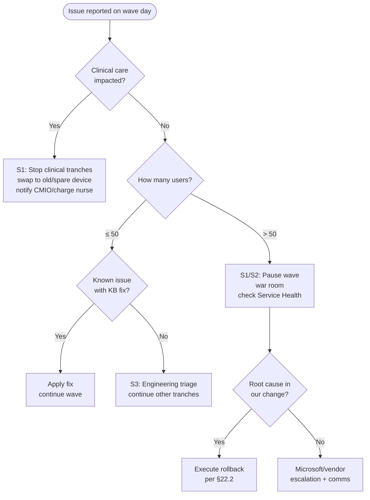

# Risk Analysis, Part 3: Regulatory, Third-Party, Technical Debt, and Downtime Scenarios

> **Risk Analysis** · IDs **R-200 to R-249** (risks) and **DT-01 to DT-15** (downtime scenarios) · Scoring per §26.1

## RA-7. Regulatory and compliance risks

| ID | Risk | Impact | Prob. | Severity | Mitigation | Contingency |
|---|---|---|---|---|---|---|
| R-200 | **HIPAA risk analysis not updated** for the new architecture before go-live | OCR finding; enforcement exposure | M | High | Update risk analysis by M5 (§28.1), refresh at M12 | Rapid risk analysis addendum |
| R-201 | **PHI in migration tooling/partner environments** without a BAA | Unauthorized disclosure | L | **Critical** | BAAs with partners; Migration Manager agents on Contoso-controlled servers; no PHI copies on partner systems | Breach risk assessment |
| R-202 | **Audit log retention gaps** during transition (old SIEM retired before Sentinel retention is configured) | Inability to investigate incidents / evidence gaps | M | High | Overlap period; retention policies configured before cutover; archive old SIEM data | Restore from archive |
| R-203 | **Unique user identification violated** by shared/generic clinical accounts carried into the cloud | HIPAA §164.312(a)(2)(i) finding | M | High | Eliminate generic user accounts; badge/CBA individual sign-in | Documented compensating controls |
| R-204 | **Encryption safe harbor lost** for devices where BitLocker keys weren't escrowed before migration | Lost device becomes a reportable breach | M | High | Compliance requires escrow; escrow remediation before workload switch | Device wipe + breach assessment |
| R-205 | **PCI DSS scope creep** (kiosks joined to the same groups/policies as general devices) | PCI non-compliance | M | Medium | Separate kiosk groups, policies, network segments; QSA review | Re-segmentation |
| R-206 | **Part 11 validated system invalidated** by an uncontrolled OS/agent change (Autopatch, MDE, Intune policies) | Regulatory finding; data integrity | M | High | Exclude validated workstations from automatic rings; validation change control | Re-validation |
| R-207 | **Records retention violated** by deletion of file-share data (D-05) or MECM DB without hold checks | Legal exposure | L | High | Legal sign-off; hold checks; immutable archive | Restore |
| R-208 | **Monitoring tools perceived as surveillance** (Remote Help, Endpoint Analytics, Insider Risk) | Labor relations / privacy complaints | M | Medium | Privacy notices, minimum necessary data, RBAC | Feature scope reduction |
| R-209 | **AI features (Copilot) processing PHI** outside BAA scope | Unauthorized disclosure | L | High | Confirm BAA coverage; restrict roles; guidance | Disable feature |

## RA-8. Third-party integration impacts

| ID | Third party | Impact of migration | Prob. | Severity | Mitigation | Contingency |
|---|---|---|---|---|---|---|
| R-210 | **EHR vendor** (e.g., Epic): Citrix/AVD certification, workstation requirements, print services, Hyperspace SSO | Certification gating VDI; supported-configuration risk | H | High | Formal engagement via vendor's technical services; follow vendor guidance for Entra join / AVD | Keep Citrix; Path D |
| R-211 | **Badge SSO vendor**: Entra join support, CBA integration, shared-device mode | Shared clinical blocked (R-003) | M | High | Upgrade roadmap, lab testing | Path D |
| R-212 | **Cisco ISE / network vendor**: Intune compliance integration, cert-based authZ | Wi-Fi/wired auth (R-175) | M | **Critical** | Version check; lab; vendor TAC engagement | Onboarding SSID |
| R-213 | **MFP vendor**: Universal Print native support, scan to cloud, firmware | Print/scan disruption | M | Medium | Firmware upgrade program; connector for legacy | Retain print server for specific models |
| R-214 | **OEMs (Dell/HP/Lenovo)**: Autopilot registration, BIOS/firmware tools | Autopilot unavailable for new devices if registration not set up | M | High | Contract clause: Autopilot registration with group tag; test orders | CSV hash upload |
| R-215 | **Medical device vendors**: AD accounts, SMB shares, DNS/DHCP | Device connectivity/function | M | High | Biomed engineering partnership; vendor letters | Retain dependencies in residual AD |
| R-216 | **SaaS vendors on AD FS** (SAML RPTs) | Re-configuration needed during defederation | H | Medium | RPT migration plan with vendors scheduled | Keep AD FS until all migrated |
| R-217 | **Payment/PCI vendors** for check-in kiosks | Kiosk app compatibility with Assigned Access/App Control | M | Medium | Vendor validation | Keep existing kiosk build |
| R-218 | **Telehealth platform** (peripherals, browser requirements) | Telehealth session failures | M | Medium | Include in P2/P3 app set | Temporary exceptions |
| R-219 | **Managed security service provider (MSSP)** transitioning to Sentinel/Defender | Monitoring gap | M | High | Contracted transition plan; overlap | Internal SOC cover |
| R-220 | **Microsoft service changes** (deprecations, packaging) | Rework | H | Medium | Change radar (R-009) | Re-plan |

## RA-9. Technical debt

| ID | Technical debt item | Risk if carried forward | Prob. | Severity | Mitigation | Contingency |
|---|---|---|---|---|---|---|
| R-221 | **~1,150 GPOs** with contradictions | Replicating chaos in Intune | H | Medium | Baseline-first approach (§14) | — |
| R-222 | **~1,350 service accounts**, non-expiring passwords | Kerberoasting; migration blockers | H | High | Inventory, gMSA/dMSA, managed identities; owners mandatory | Disable unowned after notice |
| R-223 | **Deep folder structures & broken inheritance** on shares | Migration failure/oversharing | H | Medium | Restructure during migration | Azure Files for exceptions |
| R-224 | **14 OSD task sequence variants** | Pressure to "rebuild the image in Intune" | M | Medium | Principle: no golden image; vanilla OEM + Autopilot | — |
| R-225 | **Undocumented scripts in MECM** (baselines, run scripts, packages) | Lost functionality after decommission | M | Medium | MECM script inventory → Remediations or retire | Recover from MECM DB archive |
| R-226 | **Remediation scripts used as permanent GPO replacements** | New technical debt in Intune | H | Medium | Debt register, quarterly review (§33.1.2) | — |
| R-227 | **Static group sprawl** in Intune | Mis-targeting, slow evaluation | H | Low | Filters + dynamic groups standard | Cleanup sprint |
| R-228 | **Stale Entra devices and duplicate Hybrid/Entra records** after Path B | Inaccurate inventory; CA confusion | H | Low | Cleanup automation (§17.5 step 9) | Manual cleanup |
| R-229 | **Old DNS records, SPNs, and computer objects** left after decommissions | Spoofing risk, confusion | H | Low | Decommission checklist | — |
| R-230 | **Personal macros, Access DBs, and shadow IT** | Business process breakage | M | Medium | Power Platform migration program; ownership | User-owned with support boundary |

## RA-10. Downtime scenarios

Each scenario defines the **expected planned downtime**, the **unplanned failure mode**, and the **response**.

| ID | Scenario | Planned downtime (who/how long) | Unplanned failure mode | Probability | Severity | Prevention | Response / recovery |
|---|---|---|---|---|---|---|---|
| DT-01 | **Path B device conversion** (per user) | 45–90 min per user, scheduled | Autopilot/ESP failure → user without device | M | Medium | KFM gate, thin ESP, tranche scheduling | Reset/retry; spare device swap within 1 h |
| DT-02 | **Clinical unit device swap** | ≤ 10 min per workstation, rolling by room | EHR access unavailable on swapped device | L | **Critical** | Tranche by pod; spare WoWs; vendor on standby | Revert to old device (kept 7 days on unit) |
| DT-03 | **Share cutover** (per department) | Read-only window 2–4 h (final delta) | Missing data / permissions → access denied | M | High | Delta passes; permission validation | Re-open source read-write; fix permissions |
| DT-04 | **Defederation** (tenant-wide) | None for users expected; sign-in token refresh over 1–4 h | Sign-in failures across apps | L | **Critical** | Staged rollout 100 % for 30 days | Re-federate (1–2 h) |
| DT-05 | **AD FS decommission** | None | Forgotten RPT fails | M | Medium | 30-day zero-issuance monitoring | Recreate app in Entra (hours) |
| DT-06 | **Co-mgmt workload switch** | None (background) | Policy conflict causing device misconfiguration | M | Medium | Pilot collections; GPO unlink discipline | Slider back |
| DT-07 | **CA enforcement** | None | Lockout of a population | M | High | Report-only data; staged | Report-only revert (< 15 min) |
| DT-08 | **Cert/Wi-Fi profile change** | None | Wi-Fi disconnects at a site | M | **Critical** | Dual certs; ISE monitoring; staged per site | ISE rollback; onboarding SSID |
| DT-09 | **Universal Print cutover** (per site) | 15 min (re-add printers) | Printing unavailable | M | Medium | Pre-provision printers through Intune before cutover | Print server queues restored (kept 30 days) |
| DT-10 | **MECM decommission** | None | Lost capability discovered late (e.g., a report, an OSD need) | M | Medium | Decommission gate; consumer sign-off | Restore from DB archive to a temporary site (days) |
| DT-11 | **DC demotion / IP retirement** | None | Hard-coded consumer fails (R-121) | M | High | Per-DC consumer count = 0 | Re-add IP / temporary DC |
| DT-12 | **DNS/DHCP re-platform** | Maintenance window 1–2 h per site | Medical device connectivity loss | L | **Critical** | Biomed sign-off; reservation validation; staged by scope | Restore scope on old server |
| DT-13 | **Autopatch feature update** | 30–60 min restart per device, in maintenance window | App incompatibility post-update | M | Medium | Ring progression, safeguard holds, app testing | Pause ring; rollback (uninstall within window) |
| DT-14 | **Microsoft cloud service incident** (Intune/Entra/Exchange) | — | Management or sign-in degraded | L | High | Service Health monitoring; resilient design | Comms; wait; downtime procedures |
| DT-15 | **Entra Connect sync failure** | — | New hires/password changes not synced | M | High | Version compliance; Connect Health; staging server | Promote staging server (< 1 h) |

### RA-10.1 Downtime decision tree (wave day)

